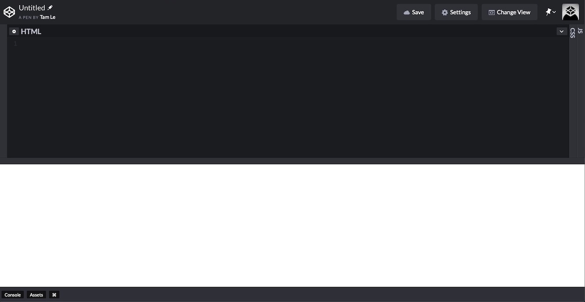

## Overview
Here's what we will learn about this lesson:
- HTML and why it's important
- HTML elements: nesting, empty elements, case-insensitivity, new lines
- CodePen

***

## What is HTML?
HTML is a language used to build web pages. You use it for the content and structure of your web page.
HTML stands for "hypertext markup language". That's... kind of confusing, so how about we break that down?

"Hypertext" means, "text that links to something". Think about links on websites (hyperlinks): when you click on them, they take you somewhere else.
For example, if you [click on this text](https://www.google.com), it'll take you to Google. Text that links to something - hypertext.

"Markup language" means, "language that uses tags". It's similar to a programming language, but it uses "tags".
For example, look at the HTML code below. Don't worry if you don't understand it right now. After the next few lessons, you will!

``` html
<!DOCTYPE html>
<html lang="en">
<head>
  <meta charset="UTF-8">
	<title>The Website's Title</title>
</head>
<body>
	<h1>Welcome to the website!</h1>
</body>
</html>
```

Notice the "tags" like `<h1>`. They start and end with angle brackets ("arrows" `<>`) and there's a word inside.
That's all a "markup language" is, using these `<tag></tag>` things to create documents.


## Why is HTML important?
You **need** HTML to build a web page. You can make a website without CSS, though it won't look very nice. 
You can also make a website without JavaScript, though it won't be "interactive". But HTML is essential.

Don't worry if you don't know what CSS and JavaScript are - we will learn these in future lessons!

The main point: HTML is necessary. It's the backbone of your web page.


## Let's Dive In
We're going to start writing code. Yes, right now. Please visit this link: [click on me!](https://codepen.io/pen/).  
This is a free, online code editor. I know I asked you to download VS Code, but CodePen is great for starting out.
You can write code and the results will show up (almost) instantly. 
You don't need an account to use it, but if you want to save the code, or if you just like the website, feel free to make one.

When you open the site, you should see 3 windows: HTML, CSS, JS.  
We will only be using the HTML window, so feel free to resize the other windows by clicking and dragging the bars and moving them to the right.


Now, I want you to do 3 things:
	1. Type in a line of code. Do not copy and paste!
	2. Once you're done, explain what happened in your own words.
	3. Repeat until finished

So in the HTML box, type this: 
```
<h1>Intro to HTML</h1>
```
What happened? If nothing happened, make sure you typed in the `<tags>` correctly. Be careful with the backslash, /, in the last tag. 

If everything went well, you should see "Intro to HTML" in large text.  
Now, add these lines below the `<h1>`. Remember to explain in your own words what happens.

``` html
<h2>Time to learn HTML</h2>
<h3>More text here</h3>
<p>This is some regular text</p>
```

What happened? If you typed it correctly, you should see something like this:
<h1>Intro to HTML</h1>
<h2>Time to learn HTML</h2>
<h3>More text here</h3>
<p>This is some regular text</p>
<br>

`<h1>` is bigger than `<h2>`, which is bigger than `<h3>`.  
`<p>` just looks like normal text.


## HTML Elements
Now that you've had a taste of HTML, let's take a closer look.

HTML documents are made up of "elements".  
An HTML element has 3 parts:
1. Opening Tag `<h1>`
2. Stuff inside `<h1>Intro to HTML`
3. Closing Tag `<h1>Intro to HTML</h1>`


## Nesting
HTML elements can be "nested", meaning they can be put inside of each other.
```html
<div>
	<h1>Hello</h1>
</div>
```
Here, we have a `<div>` wrapped around a `<h1>`. 
We will be learning about `<div>` later. For now, just know that it's like a container for other tags.
Note that nesting follows the same pattern as before: `<tag> content </tag>`.
But this time, "content" is another element. The nesting doesn't stop there. Another example:

``` html
<div>
	<h1>My Cool
		<span>Title</span> 
	</h1>
	<p>Some regular 
		<strong>Text</strong>
	</p>
</div>
```

Again, we'll cover all these elements (and more) later. But for now, I hope you understand how nesting works.


## Empty Elements
Some elements don't have closing tags.
For example, one empty element is `<br>`, which represents a line break (new line).
Note that it doesn't have any content or closing tag.

Type this into CodePen and see what happens.

```html
<p>Before Line Break</p>
<br>
<p>After Line Break</p>
```


## Case Insensitive
```html
<strong>Some Text</strong>
<br>
<STRONG>Some Text</STRONG>
```
Think for a moment: are there any differences between these two lines of code?

Once you've come up with an answer, type the code in CodePen.

<strong>Some Text</strong>
<br>
<STRONG>Some Text</STRONG>

As you can see, `<strong>` is the same as `<STRONG>`.  
It's also the same as `<Strong>`, `<STrOnG>`, etc.  
All these elements do the same thing; the capitalization doesn't change the result.
However, it is best practice to use lowercase tags. 
Go back and look at all the HTML tags you've seen so far. All the tags are in lowercase.


## New Lines
Okay, how about these two pieces of code:
```html
<div><h1>Hello, World</h1></div>

<div>
	<h1>Hello, World</h1>
</div>
```
What do you think: same or different? Type the code block into CodePen and see what happens.
Yeah, both of them produced the same result.
Now, I have another question: which way do you think is better?

In the example above, there isn't a huge difference. But what about this:
``` html
<!DOCTYPE html><html lang="en"><head><meta charset="UTF-8"><title>The Website's Title</title></head><body><h1>Welcome to the website!</h1></body></html>
```
This is the code from the beginning of this lesson. Tough to read, right?
But if you put each element on a new line and indent it, it becomes much easier to understand (well, once you know what each element means).
Here's the code from the beginning again:

``` html
<!DOCTYPE html>
<html lang="en">
<head>
  <meta charset="UTF-8">
	<title>The Website's Title</title>
</head>
<body>
	<h1>Welcome to the website!</h1>
</body>
</html>
```

***

## Summary
Good job making it through the first lesson! You should be able to recognize some elements now, but there is still much, much more to learn! 
This is a small, but important step on your journey to becoming a web developer.

Here's what we covered this lesson:
- HTML is a language used to structure websites.
- HTML documents are made up of HTML elements.
- typing code in CodePen
- HTML element format: `<h1>Hello World</h1>`
- elements can be nested
- empty elements: elements without content or closing tag, `<br>`
- elements are case-insensitive; best standard is lowercase
- use new lines and indents to make HTML code readable

If there was anything you didn't understand, please leave a comment and I'll do my best to explain it better.


## Praxis
Studying is great and all, but you know what really helps with learning? Practice.
As Confucius (supposedly) said, *"Knowledge without practice is useless"*.

At the end of each lesson, there will be challenges for you to complete. Please try to complete all of them before you move onto the next lesson. 

### Challenge: Element Experiment
1. Go to this site: https://developer.mozilla.org/en-US/docs/Web/HTML/Element
2. Find 5 **NEW** elements that interest you (I'd recommend elements related to text; they'll be easier to work with)
3. Try and use them in CodePen. Read about their usage on the website linked in step 1.
4. Share your project in the comments below or by emailing me at [tam@philosocode.com](mailto:tam@philosocode.com)


## Sources
- [MDN - Getting Started With HTML](https://developer.mozilla.org/en-US/docs/Learn/HTML/Introduction_to_HTML/Getting_started)
- [MDN - HTML Element Reference](https://developer.mozilla.org/en-US/docs/Web/HTML/Element)
- [Image Source](https://www.pexels.com/photo/business-code-coding-computer-270360/)