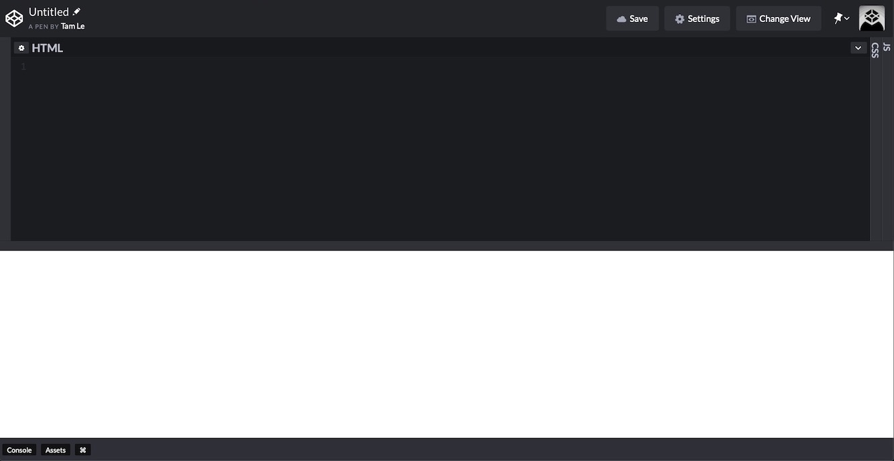

## Overview
Here's what we're going to learn this lesson:
- HTML and why it's important
- HTML elements: nesting, void elements, case-insensitivity, new lines
- CodePen

***

## What is HTML?
HTML is a language for building web pages. It's used for the content and structure of the web page.
HTML stands for "hypertext markup language". 

"Hypertext" means, "text that links to something". 
Think about links on websites that you can click on. These are hyperlinks: when you click on them, they take you somewhere else.  
For example, if you [click on this text right here](https://www.google.com), it'll take you to Google. 
So, hypertext is just text that links to something. Maybe it's another website, or maybe it's a file, but it links to *something*.

"Markup language" means, "language that uses tags to markup documents".

Let's say you're *sooo* excited about programming that you decide to write an essay about HTML.  
When you're done, you send it to me. Then, I correct your essay and grade you on your enthusiasm for web development.
Before I send it back to you, I can highlight the parts that need improvement, underline spelling and grammar mistakes, and emphasize the parts I like.

Those are the two sides of the coin:
1. The text content or words that you write
2. The "markup" I add to the content

That's what markup languages do. 
They use "tags" to tell the computer how to organize and format the text.

Do you want to emphasize some text?  
Add some line breaks?  
Style some text differently?  
Organize your text inside of lists or tables?

You can do all of this (and much more) using HTML.

Now, look at the HTML code below. Don't worry if you don't understand it right now. After the next few lessons, you will!

``` html
<!DOCTYPE html>
<html lang="en">
<head>
  <meta charset="UTF-8">
	<title>The Website's Title</title>
</head>
<body>
	<h1>Welcome to the website!</h1>
</body>
</html>
```

Notice the "tags" like `<h1>`. 
They start and end with angle brackets ("arrows" `<>`). 
There are letters and numbers inside of each `<tag>`


## Why is HTML important?
You **need** HTML to build a web page. You can make a website without CSS, though it won't look very nice. 
You can also make a website without JavaScript, though it won't be "interactive". But HTML is essential.

(Don't worry if you don't know what CSS and JavaScript are - you'll learn about these in future lessons!)


## Let's Dive In
Let's start writing code. 
Please visit this link: [click on me!](https://codepen.io/pen/).  
This is CodePen, a free, online code editor.
I know I asked you to download the VS Code text editor, but CodePen is great for starting out.  
You can write code and the results will show up (almost) instantly on the screen, whereas using VS Code will require a bit more work.
You don't need to make an account on CodePen unless you want to save your code.

When you open the site, you should see 3 windows: HTML, CSS, JS.  
You'll only be using the HTML window, so resize the other windows by clicking and dragging the bars and moving them.


Now, I want you to do 3 things:
	1. Type in a line of code. Do not copy and paste!
	2. Once you're done, explain what happened in your own words.
	3. Repeat until finished

In the HTML box, type this: 
```
<h1>Intro to HTML</h1>
```
What happened? If nothing happened, make sure you typed in the `<tags>` correctly. 
Be careful with the forward slash  **/**  in the last tag. 

If everything went well, you should see "Intro to HTML" in big, bold text.  

<h1>Intro to HTML</h1>
<br>

Now, add these lines below the `<h1>`. Remember to explain in your own words what happens.

``` html
<h2>Time to learn HTML</h2>
<h3>More text here</h3>
<p>This is some regular text</p>
```

What happened? If you typed it correctly, you should see something like this:
<h1>Intro to HTML</h1>
<h2>Time to learn HTML</h2>
<h3>More text here</h3>
<p>This is some regular text</p>
<br>

`<h1>` is bigger than `<h2>`, which is bigger than `<h3>`.  
`<p>` just looks like normal text.


## HTML Elements
Now that you've had a taste of HTML, let's take a closer look.

HTML documents are made up of these "elements".  
An HTML element has 3 parts:
1. Opening Tag `<h1>`
2. Stuff inside `<h1>Intro to HTML`
3. Closing Tag `<h1>Intro to HTML</h1>`

It's like making a (code) sandwich.
You have two slices of bread - the opening and closing tag.
You also put stuff in between (ham, lettuce, cheese, etc). 
That's the content inside of the tags, the content of the element.


#### Your Turn: Create 3 Random Elements
You can use whatever words or numbers you want.  
I've listed an example below.  
Note that these are not actually HTML elements! If you put them into CodePen and nothing will happen. 

This is just for getting used to writing HTML elements.

```html
<cat1>Meow</cat1>
<dog1>Woof</dog1>
<mypet2000000>My Pet</mypet2000000>
```


## Nesting
HTML elements can be "nested", meaning they can be put inside of each other.
```html
<div>
	<h1>Hello</h1>
</div>
```
Here, we have an `<h1>` inside of a `<div>`
You'll learn about `<div>` later. For now, just know that it's like a container for other tags.
Note that nesting follows the same pattern as before: `<tag> content </tag>`.
But this time, "content" is another element. The nesting doesn't stop there. Another example:

``` html
<div>
	<h1>My Cool
		<span>Title</span> 
	</h1>
	<p>Some regular 
		<strong>Text</strong>
	</p>
</div>
```

Again, we'll cover all these elements (and more) later. 
But for now, I hope you understand how nesting works.


## Void Elements
Some elements don't have a closing tag.  
For example, `<br>` is a void element that represents a line break (new line).
Notice that it doesn't have any content or closing tag.
Type this into CodePen and see what happens.

```html
<p>Before Line Break</p>
<br>
<p>After Line Break</p>
```

Here are some more examples (we'll learn more about them later):
```html

<input>
<link>
```

Void tags can also be written like this:
```html
<br />

<input />
<link />
```

So just pick the style you like the best.


## Case Insensitive
```html
<strong>Some Text</strong>
<br>
<STRONG>Some Text</STRONG>
```
Think for a moment: are there any differences between these two lines of code?

Once you've come up with an answer, type the code in CodePen.

<strong>Some Text</strong>
<br>
<STRONG>Some Text</STRONG>

As you can see, `<strong>` is the same as `<STRONG>`.  
`<strong>` is also the same as `<Strong>`, `<STrOnG>`, etc.  
All these elements do the same thing; the capitalization doesn't change the result.
However, it's "best practice" (best way to do something) to use lowercase tags. 
Go back and look at all the HTML tags you've seen so far. All the tags are in lowercase.


## New Lines
Okay, how about these two pieces of code?  
Do they do the same thing or not?

```html
<div><h1>Hello, World</h1></div>

<div>
	<h1>Hello, World</h1>
</div>
```
Type the code block into CodePen and see what happens.

Yeah, both of them produced the same result.  
Now, I have another question: which way do you think is better?

In the example above, there isn't a huge difference. But what about this:
``` html
<!DOCTYPE html><html lang="en"><head><meta charset="UTF-8"><title>The Website's Title</title></head><body><h1>Welcome to the website!</h1></body></html>
```
This is the code from the beginning of this lesson. Tough to read, right?
But if you put each element on a new line and indent it, it becomes much easier to understand (well, once you know what each element means).
Here's the code from the beginning again:

```html
<!DOCTYPE html>
<html lang="en">
<head>
  <meta charset="UTF-8">
	<title>The Website's Title</title>
</head>
<body>
	<h1>Welcome to the website!</h1>
</body>
</html>
```

***

## Summary
Good job making it through the first lesson! 
You should be able to recognize a few HTML elements now, but there is still much, much more to learn! 
This is a small, but important step on your journey to becoming a web developer.

Here's what we covered this lesson:
- HTML is a language used to structure websites.
- HTML documents are made up of HTML elements.
- typing code in CodePen
- HTML element format: `<h1>Hello World</h1>`
- elements can be nested
- void elements: elements without content or closing tag, `<br>`
- elements are case-insensitive; best standard is lowercase
- use new lines and indents to make HTML code easier to understand

Was there anything you found difficult or had trouble understanding?
Anything you think I can do better in this lesson?  
Please leave a comment and I'll do my best to reply as soon as I can!


#### Worksheet
Here's the worksheet for this lesson: [click here!](worksheet)


#### Lastly...
If there was anything you didn't understand, need help with, or think I could explain better, please let me know!
I appreciate every response and will reply as soon as I can.

***

## Sources
- [MDN - Getting Started With HTML](https://developer.mozilla.org/en-US/docs/Learn/HTML/Introduction_to_HTML/Getting_started)
- [MDN - HTML Element Reference](https://developer.mozilla.org/en-US/docs/Web/HTML/Element)
- [Image Source](https://www.pexels.com/photo/business-code-coding-computer-270360/)