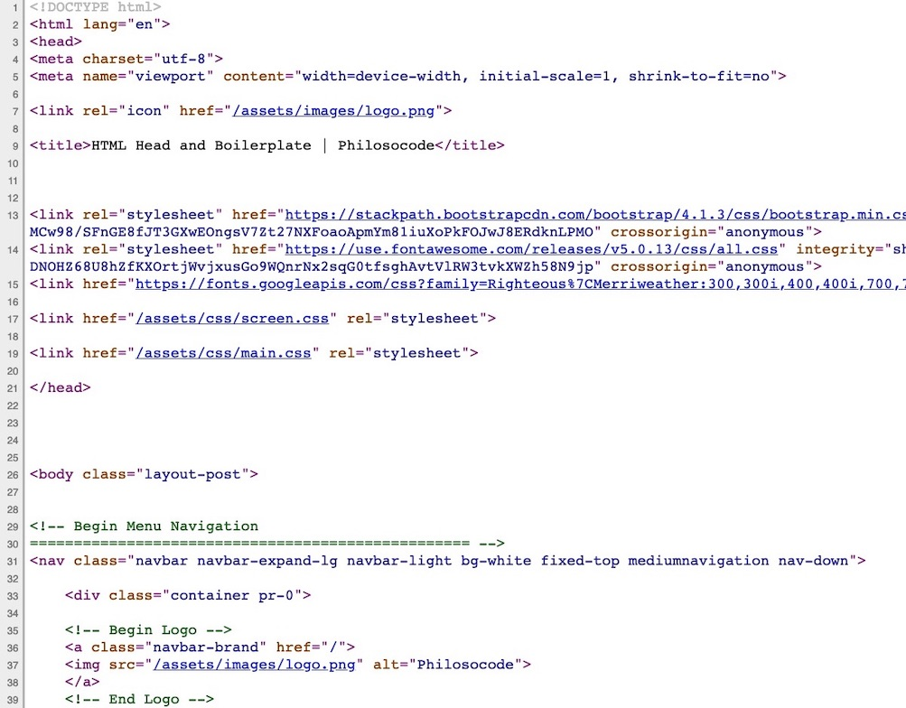
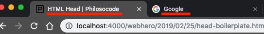
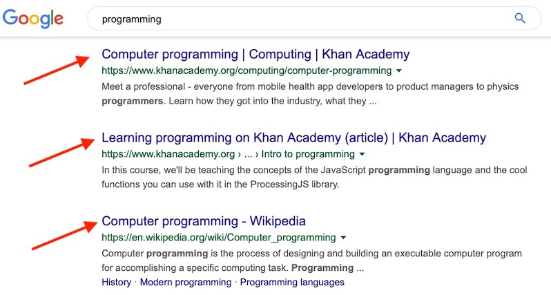

## Overview
Here's what you're going to learn this lesson:
- the `<head>` tag, what it does, and what can go inside of it

---

## Challenge: View Page Source Code
Let's start off with a challenge.  
Do you see the nice, empty, white background to the left and right of this text?
Right click on it, and choose "View Page Source". 
If you don't see this option, make sure you're not right clicking on an image or text.

If you did this correctly, you should see something like this.



This is the code for this lesson page you are viewing right now! It's alright if it doesn't match exactly.
(*side note: I didn't write out the code myself. I used a tool to create the HTML*)  
Don't worry if you don't understand most of it. 
As you learn more about HTML and practice building your own websites, it will all start to make sense.

Now, your next task is to find the opening `<head>` and closing `</head>` tags.  
We're going to take a closer look at the code inside.

``` html
<head>
  <meta charset="utf-8">
  <link rel="icon" href="/assets/images/logo.png">

  <title>HTML Head | Philosocode</title>
      
  <link rel="stylesheet" href="https://stackpath.bootstrapcdn.com/bootstrap/4.1.3/css/bootstrap.min.css" integrity="sha384-MCw98/SFnGE8fJT3GXwEOngsV7Zt27NXFoaoApmYm81iuXoPkFOJwJ8ERdknLPMO" crossorigin="anonymous">
  <link rel="stylesheet" href="https://use.fontawesome.com/releases/v5.0.13/css/all.css" integrity="sha384-DNOHZ68U8hZfKXOrtjWvjxusGo9WQnrNx2sqG0tfsghAvtVlRW3tvkXWZh58N9jp" crossorigin="anonymous">
  <link href="https://fonts.googleapis.com/css?family=Righteous%7CMerriweather:300,300i,400,400i,700,700i" rel="stylesheet">
  <link href="/assets/css/screen.css" rel="stylesheet">
  <link href="/assets/css/main.css" rel="stylesheet">
</head>
```

## What's The <head>?
The head contains "metadata" about the webpage.  
That's just a fancy word that means, "information about this page". 

For example:
- the page title (search engine results, browser tab text)
- the author
- the website's description (search engine results)
- CSS/JS files that are used
- the site icon
- and more...

The stuff between the `<head>` tags does not actually appear on the page.  
It just *describes* the page.


## What's IN The <head>?
There's a lot that can go in the `<head>`, but we're only going to cover the important things you'll usually see.
Don't worry about memorizing all of this. If you ever forget, or come across an element you haven't seen before, Google (or your favourite search engine) is just a few clicks away!

#### Title
```html
<title>My Webpage</title>
```
The title is the text that will appear in browser tabs, search engine results, and bookmarks.


When you do a Google search, all those blue hyperlinks are actually website titles.


#### Charset
```html
<meta charset="utf-8">
```
Last lesson, you learned that a tag can look like this:

```html
<tag attributeKey="attributeValue"></tag>
```

`charset="utf-8"` is the attribute for the `<meta>` tag.  
But what does it even mean?

`charset` means, "how is this document 'encoded'?"  
`utf-8` is the "encoding method" used. Altogether, it means, "this document was encoded with 'utf-8'"

For now, all you need to know is this: 
- UTF-8 contains characters from every human language. For example, check out [this site](https://mcdlr.com/utf-8/#1). 
All of those characters you see? They're in UTF-8... and there are a lot! 
- `charset="utf-8"` means you can use any language in your webpage. English, Korean (한국어), Japanese (日本語), Arabic (العَرَبِيَّة) etc, will all show up properly because of the `charset="utf-8"` attribute. This is important because not everyone in the world uses English

#### Meta Tags
``` html
<meta name="author" content="Tam Le">
```
"author" is the author/creator of the webpage. For "content", you put in the actual name of the author.

```html
<meta name="description" content="Description of this site">
```
This one is similar to the above. You use this to describe the webpage. For example:
```html
<meta name="description" content="The purpose of this webpage is to teach programming">
```

#### Meta Tag Syntax
```html
<meta name="something" content="something">
```
The syntax (format, structure) for `<meta>` can be a little confusing.  

The `name="something"` attribute is the type or category of information.  
For example, `name="author"` means this tag is about the author. 
`name="description"` means this tag is about the description for the website.  
It might be easier to think of `name="something"`as "category equals __" or "about the __".

The `content="something"` attribute is the actual content/value. If `name="author"`, then `"content="author's name"`.
If `name="description"`, then `content="description for the website goes here`

```html
<meta name="viewport" content="width=device-width,initial-scale=1">
```
This meta tag is used for something called "responsive design" (we'll cover this later).  
This tag sets the width of the webpage to match the width of the device.  
For example, if you have a reallllly wide monitor, the webpage's width will be the monitor's width.
However, if you're using a smartphone, the webpage's width will be the width of the smartphone.

#### Link
Link tags are used to... wait for it... link to other files.  
You'll usually use them for CSS files and icons.

```html
<link rel="icon" href="/assets/images/logo.png">
```
Just by reading this line of code, you should know what it does.  

The `rel="icon"` attribute means, "icon for the site".

`href` stands for "Hypertext REFerence", which just means, "link to another file".  
You'll see `href` again later when we cover the `<a>` tag.

The `="/assets/images/logo.png"` attribute is the path to the icon. It can be broken down into two parts:
1. Location of the icon/file: `/assets/images` folder on my computer
2. The name of the icon/file: `logo.png`

```html
<link rel="stylesheet" href="my-css-file.css">
```
You use the `rel="stylesheet"` attribute to link to a CSS file.  
Like the above example, `href="my-css-file.css"` is the path to / location of the CSS file.  
We'll cover this in greater detail when we learn about CSS!

#### Script
```html
`<script src=“my-js-file.js”></script>`
```

The `<script>` tag is similar to `<link>`. However, it links to JavaScript files using the `src` attribute.  
We'll learn more about this element when we begin using JavaScript.

#### Challenge: Spot The Difference
Alright, time for another challenge.

What are 3 differences between the `<link>` and `<script>` tags?


1. `<link>` has no closing tag (remember what these elements are called?). `<script>` has an opening and closing tag.
2. `<link>` has a `rel` attribute.
3. `<link>` uses `href` to link to CSS files. `<script>` uses `src` to link to JavaScript files.



## A Few More Tags...
Before we finish this lesson, I want to cover a couple important tags.  
**These tags are not part of the head**.  
Actually, they're more like the "hair", since they sit on top of the head.  
They're important because you'll see them in every HTML document.

#### !DOCTYPE
```html
<!DOCTYPE html>
```
This tag is the "document type declaration", or "DOCTYPE".

For now, you just need to know 2 things:
- it means, "this document contains HTML"
- it always goes at the very top

```html
<html lang="en">
  <!-- Every other tag goes inside -->
</html>
```
Like the above, this tag tells the browser that this is an HTML document.  
This tag is the "root element". This means it wraps around (it contains) all the other tags, including `<head>` and `<body>`

As you can probably guess, the `lang="en"` attribute just means, "this document is in English".  
If your webpage is in a different language, you should change it (Google "html lang iso codes" for more information).


## Where's The <head>?
#### Challenge: Where Does It Go?
Alright, final challenge for this lesson.  
Where do you put the `<head>`? Where should it go in the HTML?

If you need a hint, look at the code in the first challenge at the top of the page ("View Page Source Code").


The `<head>` comes after `<!DOCTYPE html>` and `<html>`. We put it before `<body>`
```html
<!DOCTYPE html>
<html lang="en">
  <head>
  <!-- Head stuff -->
  </head>
  <body>
  <!-- Body stuff -->
  </body>
</html>
```


***


## Summary
Here's what we covered this lesson:  
- viewing page source code: right click > "View Page Source"
- the head has information about the page (title, author, icons, CSS/JS files, etc)
- the stuff in between the `<head></head>` tags doesn't actually show up on the page
- `<meta charset="utf-8">`: we can use characters from different languages (English, French, Chinese, Arabic, etc)
- `<meta name="something" content="something">` are tags that describe the page
  + `<meta name="author" content="Joe">` is about the author of the page
  + `<meta name="description" content="About this page">` is about the description of the page
  + `<meta name="viewport" content="width=device-width,initial-scale=1">` sets the width of the page to the width of the device
- `<link>` tags can link to the site icon or CSS stylesheets
- `<script>` tags link to JavaScript files
- `<!DOCTYPE html>` and `<html>` are like the "hair": they go above everything else

This lesson was heavy on theory, but the upcoming lessons will be more practical and "hands-on".

I've already said this a number of times, but don't worry about trying to memorize every little detail.  
This lesson was just meant to familiarize you with the `<head>` so when you work on your own websites, the tags will be not be completely new to you. If you ever forget something, you can always refer back to this page or Google it!


#### Worksheet
Here's the worksheet for this lesson: [click here!](worksheet)


#### Lastly...
If there was anything you didn't understand, need help with, or think I could explain better, please let me know!
I appreciate every response and will reply as soon as I can.

***

## Sources
- [MDN - What's in the head?](https://developer.mozilla.org/en-US/docs/Learn/HTML/Introduction_to_HTML/The_head_metadata_in_HTML)
- [Responsive Meta Tag](https://css-tricks.com/snippets/html/responsive-meta-tag/)
- [Wikipedia - DOCTYPE](https://en.wikipedia.org/wiki/Document_type_declaration)