## It's Time
So far, you've used CodePen to create and run your HTML code.
CodePen is a great tool that makes it easy to start coding, and you can continue using it throughout these tutorials if you want.
However, knowing how to setup a project on your computer is important. And when you start working on more serious projects, this is
usually how you'll be working. 

## Overview
Here's what you're going to learn this lesson:
- how to create and open HTML files

---
## Creating HTML Files
#### Text Editor
It's finally time to use the text editor you downloaded in [Getting Started](). 
I'll assume you're using VS Code. If you're using a different text editor, the instructions may be a little different. 
If you're ever stuck, just Google it or post a comment here.

#### Step 1. Create A Folder
Create a new folder somewhere (e.g. your Desktop) to store the files.  
It doesn't matter where you put it. Just remember where it is!  

#### Step 2. Open The Text Editor
If you're using VS Code, you should see something like this: 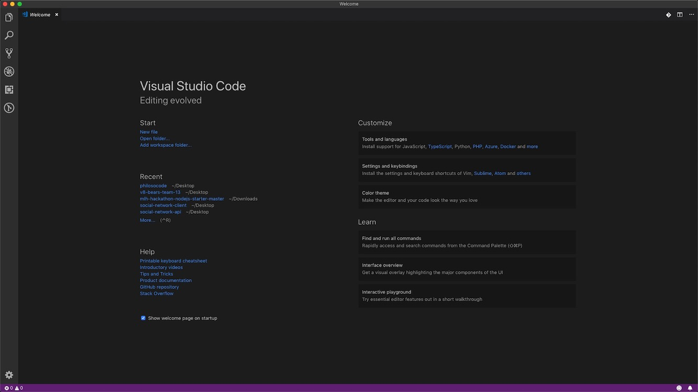

#### Step 3. Create A New File
There are a couple ways you can do this:
- press Ctrl + N on Windows/Linux, Command + N on Mac
- go to File > New File  
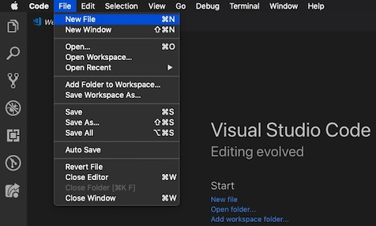

A new window with an empty file should open.
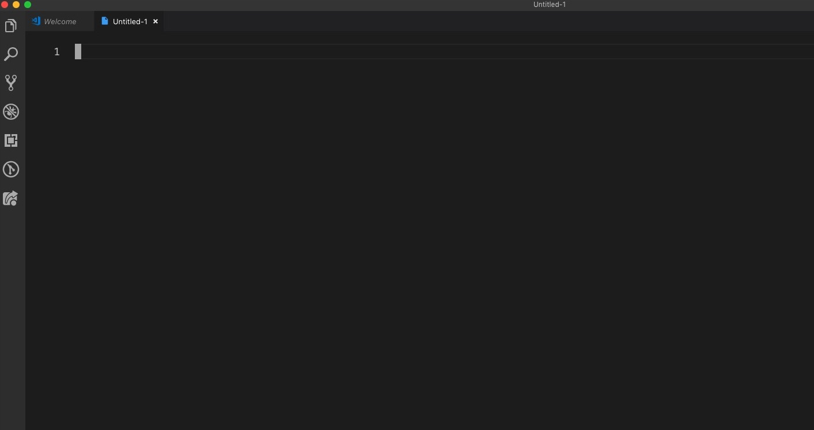

#### Step 4. Save The File
There are a couple ways you can do this:
- press Ctrl + S on Windows/Linux, Command + S on Mac
- go to File > Save  
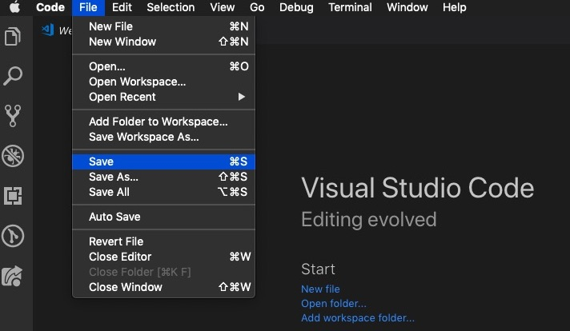

A window should appear with a box for the filename and location. 
I'm using a Mac, so the box may look a little different on your computer.  
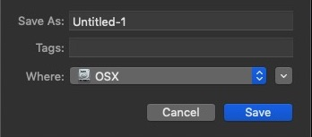

On Windows, the box looks like this:
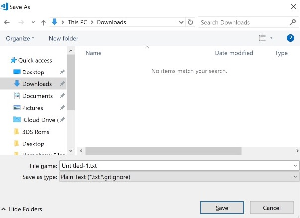

#### Step 5. Name The File
**Mac**  
Change the name of the file from "Untitled-1" to "myfile.html".  
**It is very important that the file ends in .html.**

**Windows**  
Same as above. However, you also need to change the "extension" to ".html"
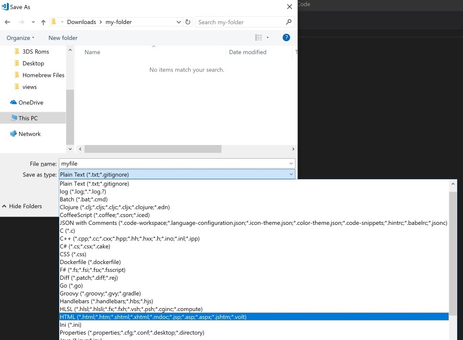

#### Step 6. Find The Folder You Created And Save The File
**Mac**
On Mac, you may have to click on the little arrow first.  

Once you click on the arrow, it should expand into a bigger window. 
Find the folder you created. Click on it. Then hit the "Save" button.
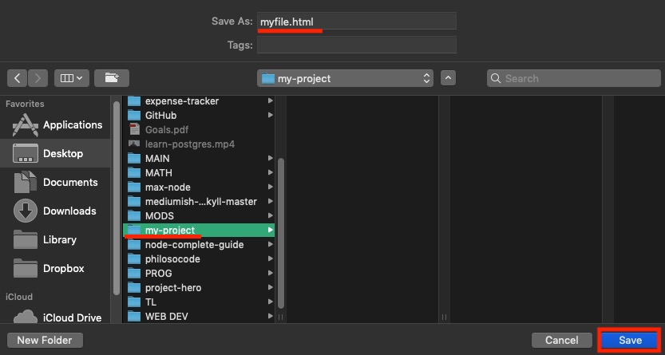

**Windows**
On Windows, you need to find the folder, "Open" the folder, and then "Save" the file.

#### Step 7. Confirm The File Was Saved
Close your text editor.  
Now, go to the folder you created. You should see the file you saved.
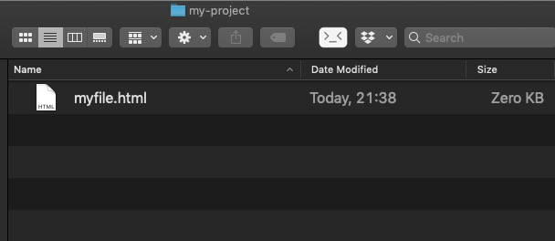

## Opening HTML Files
Remember how I told you to close your text editor? That wasn't by accident. Now, it's time to open the file you created.

#### Step 1. Open
Press Ctrl + O (oh) on Windows/Linux, Cmd + O (oh) on Mac. A window should open.

#### Step 2. Find Your File
All you have to do now is find your file, select it, and click "Open".

## HTML Boilerplate
Remember the HTML boilerplate I introduced in the first lesson? We're going to add that to the file.
If you're using VS Code or Sublime Text, there's a cool trick you can use that will save you a lot of time.  
Note that this will only work if you're in an HTML file (ends with `.html`).

Type "html:5" **without the quotation "" marks**
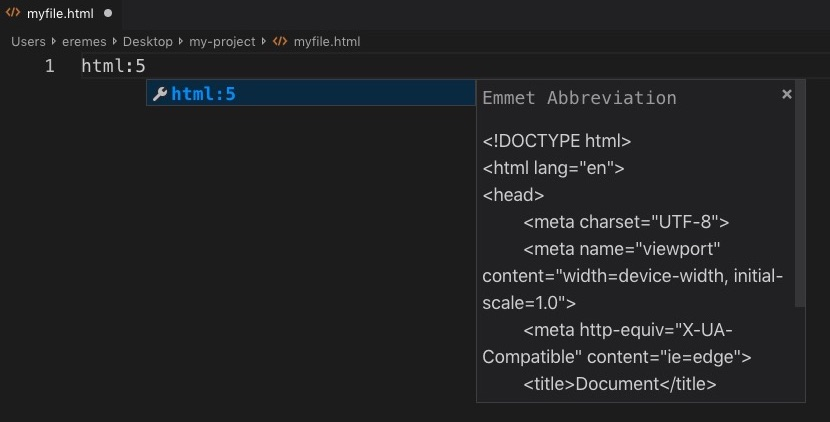

Then, hit the "Tab" on your keyboard, and the boilerplate should appear!
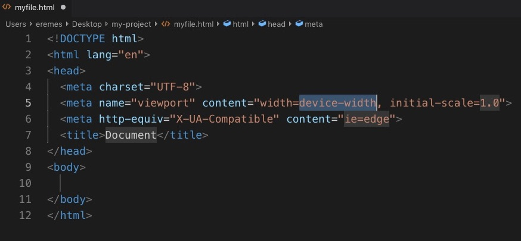

Change the content of the `<title>` tag to whatever you want (by default, it should say "Document").  
In between the `<body>` tags, write some HTML. Use what you've learned in the previous lessons.  
When you're done, save the file with Ctrl + S (Windows/Linux) or Cmd + S (Mac). Then, move onto the next step.

## Open HTML File In Browser
At this point, you should've created an HTML file and added some code to it. Now, it's time to see the results of your hard work!  

Just double click on the file and it should open in your web browser.
On Windows, you may have to choose which program you want to use to open the file. If so, just pick your web browser.

Whenever you change your HTML file, you also need to refresh the page before you see the changes 
(Ctrl + R on Windows/Linux, Cmd + R on Mac).

***

## Congratulations!
Now, you know how to create, edit, and open HTML files!  
Don't worry if it's still a little confusing. As you progress through this course, you'll get plenty of practice making HTML, CSS, and JavaScript files.

#### Challenge: Make Another File
Without looking at this lesson, try to create, edit, and open another HTML file.

#### Lastly...
If there was anything you didn't understand, need help with, or think I could explain better, please let me know!
I appreciate every response and will reply as soon as I can.