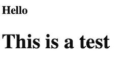
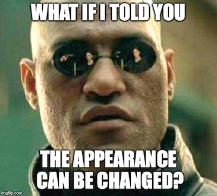

## Overview
Here's what you're going to learn this lesson:
- Tags related to text

---

## Challenge: Check Out All The Tags
Visit [this link](https://www.w3schools.com/tags/). There, you will see every HTML tag available to you.

Don't come back until you've memorized all of them!

#### Are you crazy? There are way too many tags!
Okay, I was just kidding. But it leads into the next point I want to make:

#### The 80/20 Principle
Of the ~90 tags listed on that site, you'll only use 10-15 on a regular basis.  
So don't feel overwhelmed by the amount of tags you see.  
Remember: don't memorize what you can easily look up.


## Heading Tags
You've already seen these tags before. They look like this:
``` html
<h1>Hello again!</h1>
<h3>I am a heading element</h3>
```

`<h1>` is the biggest and represents the main heading.  
You've probably already noticed, but as the number gets bigger, the size of the heading
decreases.  

`<h2>` is a bit smaller. It is a sub-heading.  

#### Question: How many numbers are there?
We've seen `<h1>` and `<h2>`. 
How many more heading tags are there? 
(HINT: now is a good time to exercise your search engine skills)


Visit this link to find out http://bfy.tw/N1by


#### But what does it mean?
`<h1>` is the main, most important heading. There should only be one per page.  
`<h2>` is a subheading. You can think of it like the chapters in a book.
`<h3>` to `<h6>` are like sub-sub-subheadings. You can think of these like sections
in a chapter.

MDN (listed in the Lesson Sources) has a great analogy.
You can think of `<h1>` as the title of the book.
`<h2>` is like a chapter in the book - there can be many.
`<h3>` to `<h6>` are like sections in the chapter.

#### How do I use the heading tags?
This is up to you to decide. 
There's nothing stopping you from using `<h1>` everywhere. 
If you don't believe me, then visit CodePen and write a bunch of `<h1>` elements. 
They will still show up properly.

However, I would not recommend this (why? You'll find out soon)

Think about what makes sense for your content and keep in mind that the "importance"
of the heading decreases as you move from `<h1>` to `<h6>`.


## Finishing Off
#### Challenge: Which is which?
In the image below, there is an `<h1>` tag and an `<h6>` tag. Which one is which?
  


The first line is an `<h1>`.
The second line is an `<h6>`.


#### Wait... what?
Yes, you read that right.  
The first line (the smaller one) is an `<h1>` and the second line, `<h6>`.  
You might be pretty confused right now. 
Actually, there's something I haven't told you yet...



By default, the browser will do 2 things:
  - make the heading elements bold
  - make `<h1>` the biggest, `<h2>` smaller than `<h1>`, etc

However, you can use CSS to change the appearance of the headings.
With CSS, you can change the colour, size, and weight (normal, italics, bold) of a text tag.
This includes heading tags.

Basically, you can make an `<h1>` look like an `<h6>`.

***


## Summary
Here's what we covered this lesson:  
- heading tags: `<h1>` to `<h6>`
  + 1 is the main, most important heading. There should only be one per page
  + importance decreases as you move from 1 to 6 (subheadings)

#### Worksheet
Here's the worksheet for this lesson: [click here!](worksheet)


#### Lastly...
If there was anything you didn't understand, need help with, or think I could explain better, please let me know!
I appreciate every response and will reply as soon as I can.

***

## Sources
- [MDN - Text Fundamentals](https://developer.mozilla.org/en-US/docs/Learn/HTML/Introduction_to_HTML/HTML_text_fundamentals)