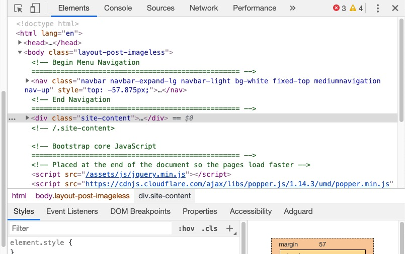
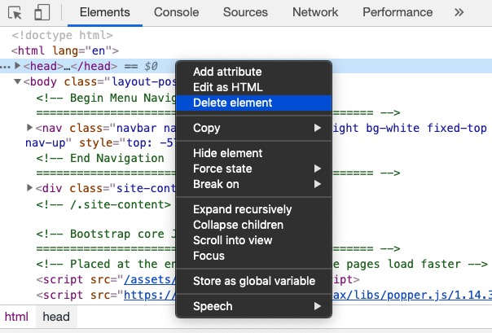
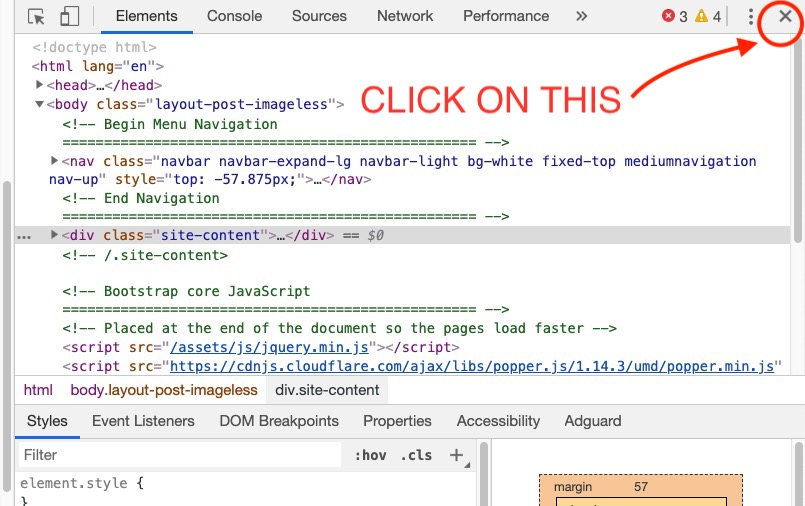

## Overview
Here's what you're going to learn this lesson:
- what is CSS?

---

## What Is CSS?
CSS stands for "cascading style sheets". You use CSS to style and layout your webpage.

#### Style? Layout?
Let's start with a quick exercise that will (hopefully) help you understand.
I'll assume you're using Google Chrome. If you're using a different browser, the steps may be a little different.
1. Open your web browser and go to a website of your choice
2. Pay attention to what the site looks like right now
3. Right click somewhere on the page and choose "Inspect" or "Inspect Element"
4. A window should appear. You should see HTML code. It should look something like this:

5. In the window with HTML code, scroll up and find the `<head>...</head>` element (it should be near the top)
6. Right click on the `<head>...</head>` element and select "Delete Element"

7. In the top right corner of the Developer Tools (not the web browser!), there's a small X.
Click on it to close the Developer Tools.



Now, take a look at the website again. 
Notice anything different?

#### What Just Happened?
The webpage should look pretty boring now.<br>
Actually, the website should look a bit like the HTML pages you created in the previous section!<br>
Now, here's a question for you: what happened when you deleted the `<head>` element?


We covered this briefly in the [HTML Head lesson](), so don't feel bad if you
couldn't figure it out.

Put simply, the CSS is stored inside the `<head>` element:
``` html
<head>
  <!-- Some CSS stuff -->
  <link rel="stylesheet" href="my.css">
  <style></style>
</head>
```
So when you deleted the `<head>` element, you also deleted the CSS inside the `<head>` element.
Since you deleted the CSS, you're left with just the HTML (and JavaScript, but that's for a future lesson =))


Now, scroll around the page for a bit. Take a good look at this boring "HTML-only" document.<br>
Then, refresh the webpage.
Notice all those styles? The font sizes, font styles, colours, borders, layout, etc, is created using CSS.

#### HTML vs CSS
HTML is responsible for the structure of the webpage. 
CSS is responsible for the appearance of the webpage. 
You use CSS to describe what the webpage should look like.

While HTML says, "Here's the content", CSS says, "Here's what it looks like."
It's like creating a book. The author is in charge of writing the words. 
The designer is in charge of creating the cover, choosing the fonts to use, etc.

Another analogy: think of CSS like a bucket of paint. HTML is the "structure" that you want to paint.
You need something to pain, you can't paint nothing, just like you can't use CSS without HTML.

## Back to CodePen
Yeah yeah, I know I made you go through an entire lesson on creating and opening HTML files using VS Code (or your text editor).
You'll learn how to create and connect CSS files to your HTML soon enough. But for now (and the next few lessons), let's go back to CodePen.

In the HTML section, paste this code in (or use your own code):
```html
<h1>Style Me</h1>
<p>Style me, too!</p>
```

This is important because you style HTML with CSS.
If you don't have any HTML, your CSS won't do anything.

You might've noticed that this isn't proper HTML.<br>
Where are the `<DOCTYPE>`, `<html>`, `<head>`, and `<body>` elements?<br>
**With CodePen**, you can just include the tags you would normally put in the `<body>`. 
For example:
```html
<body>
  <!-- CODEPEN: Just these 2 lines of code are okay -->
  <h1>Style Me</h1> 
  <p>Style me, too!</p>
</body>
```
Just want to emphasize: it's okay to do this with CodePen.
However, when you make your own HTML file, it's best practice to include the `<DOCTYPE>`, `<html>`, `<head>`, and `<body>` tags.

#### Adding CSS
Okay, back to CodePen. Make sure you add the HTML code (just those 2 lines above are okay, feel free to add more).
Then, type this into the "CSS" window/section of CodePen:
```css
h1 {
  color: red;
}
```
After you do that, the `<h1>` should turn red. 
Congrats, you just wrote your first few lines of CSS!
Let's look at this in more detail.

## CSS Syntax - Five Parts
#### 1. Selector
This is the element you want to style. In the example above, we want to style `<h1>`.
If you wanted to style the `<body>`, you could use this selector:
```css
body
```
Want to style a `<ul>`? Write this:
```css
ul
```

Notice: in these cases, the selector is just the tag name without the <, >, or closing tag.

#### 2. Curly Braces {}
```css
h1 {
  
}
```

After the tag name, you add two curly braces `{}`. Make sure you're using `{}`, not `[]` or `()`. 
The difference is small, but your code won't work if you use the wrong type of brackets!

One trick to help you remember this: use the "clam" {} brackets with CSS (well, it kind of looks like a sideways clam/oyster to me).
Both "clam" and "CSS" start with the letter C, and clams are found in the "C" (get it? C? Sea? Okay, I'll stop now)

#### 3. Property
The selector is the element you want to style (`h1`)
The property is what you want to add to or change about an element (`color`)
Some examples: changing the text colour, adding animations, or adding a border around the element.

In the example below, we want to change the text colour of the `<h1>` tag:
```css
h1 {
  color:
}
```

#### A Note On Spelling
Pay attention to spelling: color with no "u". `color`, not `colour`. Remember to use American-English spelling, not British-English spelling.

#### 4. Value
The value is what you want to set the property to.
For example, if you want to change the colour, the value might be blue.
- property: colour, value: blue
Or if you wanted to change the text size:
- property: font-size, value: 200%

```css
h1 {
  color: red
}
```

#### 5. Semicolon ;
Here's something else you haven't seen before: the semicolon.
Make sure you add a `;` right after the value.

#### Putting It All Together
1. We want to style `h1`, so we "select" it by writing its name
2. Add curly braces
3. Add property, what we want to change (`color`)
4. Add value, what we want to set the property to (`color: red`)
5. Don't forget the semicolon after the value
``` css
h1 {
  color: red;
}
```

In plain English, it means, "I want all `<h1>`s to have a (text) color of red".

Here's another example of CSS in action. This time, with 2 properties (things) to change.
``` css
p {
  color: blue;
  font-size: 500%;
}
```
Here, we want to change all the `<p>` elements to be blue and have a font size of "500%" (5x bigger than normal).

## Comments
To end this lesson off, we'll learn about comments in CSS.<br>
Here's a comment in CSS:
```css
/* Your comment goes inside here */
```
That's a backslash, `/` followed by two astericks/stars `**` and another backslash `/`
Yeah, the "syntax" (format, structure) is different compared to HTML.
```html
<!-- Your comment here -->
```
But the idea is the same. You use comments to explain your code and make it easy to understand.
Your comments are ignored by the browser. They won't show up on the page.
```css
/* Make h1 big and blue */
h1 {
  color: blue;
  font-size: 500%;
}

```
Something I didn't mention before: you can use comments to "disable" code
``` css
h1 {
  color: green;
  font-size: 100%;
}

/* h1 {
  color: blue;
  font-size: 500%;
} */
```
This is useful when you want to disable code, but don't want to delete it.

***

## Summary
Here's what we covered this lesson:<br>
- you use CSS to style and layout your webpage (in this lesson we covered the "style" part, in future lessons we'll cover layout)
- HTML is for structure, CSS is for appearance
- CSS is stored in the `<head>`
- basic CSS structure:

```css
element {
  thingToChange: valueToSet;
}

h1 {
  color: red;
  font-size: 1000000%;
}

/* I am a commennt */
/* 
h1 {
  disabled code
*/
```

#### Worksheet
Here's the worksheet for this lesson: [click here!](worksheet)

#### Lastly...
If there was anything you didn't understand, need help with, or think I could explain better, please let me know!
I appreciate every response and will reply as soon as I can.

***

## Sources
- [MDN - How CSS Works](https://developer.mozilla.org/en-US/docs/Learn/CSS/Introduction_to_CSS/How_CSS_works)