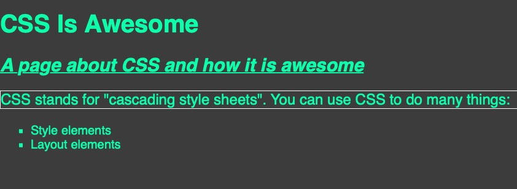

## Questions
Where do you put CSS?

Inside the `<head></head>`


What are the 2 main purposes/uses of CSS?

1. Style things
2. Layout things


Convert this into CSS code: "style all `<h3>`. Give each `<h3>` a purple color and font size of 300px" (what's a `px`? You'll learn about that soon enough!)

```css
h3 {
  color: purple;
  font-size: 300px;
}
```


## Challenges
#### CSS Research
Here's some HTML code.
```html
<h1>CSS Is Awesome</h1>
<h2>A page about CSS and how it is awesome</h2>
<p>CSS stands for "cascading style sheets". You can use CSS to do many things:</p>
<ul>
  <li>Style elements</li>
  <li>Layout elements</li>
</ul>
```
But things are a little boring right now.<br>
Your mission, should you accept, is to style the code using CSS.<br>
But here's the catch: you need to use properties you haven't learned before!
This challenge is harder than any of the previous challenges.
You might struggle, maybe even a lot. That's perfectly normal! 
You'll probably need to make good use of Google (or your favourite search engine).
1. Give the `<body>` a colour of `#08ffb5`, a background colour of `#444444`, and give it a font of `sans-serif`
- suggested searches: "CSS color code", "CSS color vs background color", "CSS set font"
2. Make the `<h2>` italicized and underlined
- suggested searches: "CSS italicize text", "CSS underline text"
3. Put a white border around `<p>` and give it a font size of `120%`
- suggested search: "CSS border"
4. Give the `<ul>` a list style type of `square`
- suggested search: "CSS list style type"

The finished result should look like this:<br>
