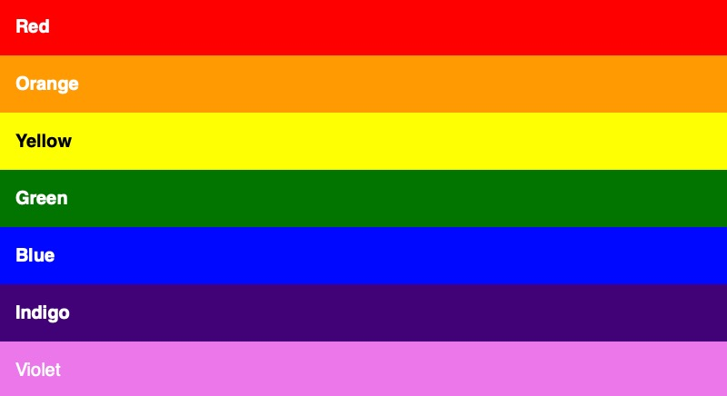

## Questions
Are these different colors?
- `#db236d`
- `rgb(219, 35, 109)`


No, they're the same


In hexadecimal, what value does `A` have? What about `F`?

A = 10
F = 15


Is this a named color? (HINT: check https://htmlcolorcodes.com/color-names/)
- `color: leafgreen`

No


What are the color channels for this hexadecimal color (i.e. which values represent red, green, and blue)?
- `#9f72e0`

- red: `9f`
- green: `72`
- blue: `e0`


What is the min and max value for rgb?

0 - 255


What is the expanded form for this color?
- `#a9b`

`#aa99bb`


rgba: What does "alpha" mean? What does an alpha of `1.0` mean?

- alpha: amount of transparency
- `1.0`: no transparency


What's the difference between `color` and `background-color`?

1. color: changes text color
2. background-color: changes the background color...


What is the shorthand for this?
- `#0055ff`

`#05f`


What is black and white in:
- hexadecimal
- rgb


Black:
- hex: `#000` or `#000000`
- rgb: `rgb(0, 0, 0)`

White:
- hex: `#fff` or `#ffffff`
- rgb: `rgb(255, 255, 255)`


What are the color channels for this rgb color?
- `rgb(159, 114, 224)`

- red: `159`
- green: `114`
- blue: `224`


What does an alpha of `0.0` mean?

Fully transparent (can't see the color)


## Challenges
#### ROYGBIV Rainbow 🌈🌈🌈
It's time to create your own rainbow with HTML and CSS.
Recreate this using CodePen.<br>


You must use hexadecimal, rgb, or rgba. Don't use named colors (that would be too easy)

Here's the HTML code:
```html
<h1>Red</h1>
<h2>Orange</h2>
<h3>Yellow</h3>
<h4>Green</h4>
<h5>Blue</h5>
<h6>Indigo</h6>
<p>Violet</p>
```

Make sure to add this to the top of your CSS:
```css
h1,h2,h3,h4,h5,h6,p {
  font-size: 1rem;
  margin: 0;
  padding: 1rem;
}
```
