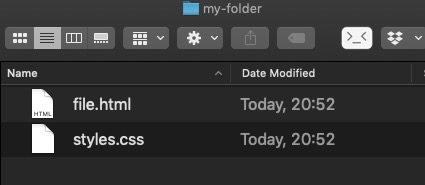
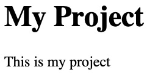
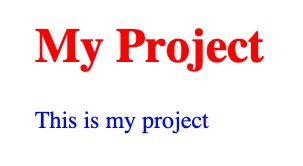

## Overview
Here's what you're going to learn this lesson:
- how to create, open, and run CSS files

---
## Before We Begin
I'm assuming that you know how to create and run HTML files. Many of the steps are the same, so check out this lesson: 
[Creating & Running HTML Files]()

You're free to use whatever text editor you want, but I'll assume you're using VS Code.
If you're using a different text editor, the instructions may be a little different. 
If you're ever stuck, just Google it or post a comment here.

## Create HTML File
This should be review to you by now. If you're stuck, feel free to visit the lesson on creating HTML files (linked above).

#### Steps
1. Create a folder
2. Open the folder in VS Code
3. Create a new file
4. Save the file. Give the file a name that ends in `.html`
5. Add HTML code. Make sure you add some elements to style in CSS.<Remember, in VS Code you can write `html:5` and press the Tab key. This will create a quick HTML boilerplate.
Alternatively, you can use this code:

```html
<!DOCTYPE html>
<html lang="en">
<head>
  <meta charset="UTF-8">
  <meta name="viewport" content="width=device-width, initial-scale=1.0">
  <meta http-equiv="X-UA-Compatible" content="ie=edge">
  <title>My Project</title>
</head>
<body>
  <h1>My Project</h1>
  <p>This is my project</p>
</body>
</html>
```

At this point in time, you should:
- have a folder
- inside the folder, have an HTML file with code

## Create CSS File
Creating a CSS file is almost the same as creating an HTML file. Instead of ending in `.html`, you end in `.css`

#### Steps
1. Make sure you have your folder open in VS Code
2. Create a new file
3. Save the file. Give the file a name that ends in `.css`

#### Add CSS Code
Add some CSS to style your HTML.

```css
h1 {
	color: red;
}

p {
	color: blue;
}
```

Okay, so at this point, you should have a folder containing:
- an HTML file
- a CSS file

Open your folder. You should see something like this (with different file names): 

## Test It Out
Alright, time to test it out. Double-click on the HTML file (or use Live Server). The file should open in your browser.

#### Is Something Wrong?
This is what I got on my screen:



If you haven't noticed, there's a problem: the styles weren't applied!
If you look at the CSS, the `<h1>` should be red and `<p>` should be blue.

```css
h1 {
	color: red;
}

p {
	color: blue;
}
```

#### What's The Problem?
Can you think of what the problem is? Why aren't the styles showing up in the HTML?


We never linked the HTML and CSS together.<br>
The HTML has no idea that there's a CSS file!


## Link CSS to HTML
The million dollar question: how do you connect HTML and CSS together?<br>
Here's a hint: we briefly covered this in [this lesson on the HTML Head]().
Don't continue with the lesson until you've found the answer!


Use the `<link>` element


#### Linking CSS to HTML
Alright, hopefully you managed to figure it out.

This line of code is from the HTML Head lesson:

```html
<link rel="stylesheet" href="my-css-file.css">
```

Things to keep in mind:
1. The `<link>` element goes in between the `<head></head>` tags. Not the body!
2. `rel` means, "what kind of file is this?". For CSS files, you use `stylesheet`
3. `href` is the location of the CSS file. You learned about this a couple of lessons ago with the `<a>` tag

Linking to the CSS file is really easy. Just add the link tag with `rel=stylesheet`. 
In VS Code, you can type `link` and then hit the "Tab" key.

For the `href`, use your CSS file name. Since I used `styles.css`, my `<link>` will look like this:

```html
<head>
  <link rel="stylesheet" href="styles.css">
</head>
```

```html
<!DOCTYPE html>
<html lang="en">
<head>
  <meta charset="UTF-8">
  <meta name="viewport" content="width=device-width, initial-scale=1.0">
  <meta http-equiv="X-UA-Compatible" content="ie=edge">
  <title>My Project</title>

  <link rel="stylesheet" href="styles.css">
</head>
<body>
```

#### Test It Out Again
After you've added the `<link>` to the `<head>`, try opening the HTML file again.

It works!<br>


Nice work! Now, you can write HTML and CSS files locally without using CodePen.

***

## Summary
Here's what we covered this lesson:<br>
- reviewed how to create and run HTML files
- how to create CSS files
- use `<link rel="stylesheet" href="file.css">` to connect CSS files to HTML

#### Worksheet
Here's the worksheet for this lesson: [click here!](worksheet)

#### Lastly...
If there was anything you didn't understand, need help with, or think I could explain better, please let me know!

I appreciate every response and will reply as soon as I can. 