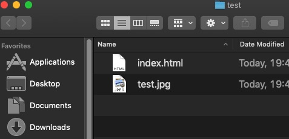
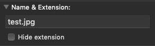

## Overview
Here's what you're going to learn this lesson:
- the image `` tag

---
## Images With ``
Today you're going to learn how to add an image in HTML.<br>
But before we begin, some quick review: 
for anchor `<a>` elements, you use the __ attribute for the destination (e.g. where the link takes you)


`href` attribute


#### Basic Syntax/Structure
The image tag is pretty simple. There are two main attributes:
- `src`
- `alt`

This is what it looks like:
```html

```

#### Void Element
The first thing to notice: where's the closing tag? Why not this?
```html
</img>
```

`img` is a "self-closing" / void element (we actually briefly covered this in the very first lesson for HTML)
This just means you don't need the closing (second) tag.

```html
<!-- Basic Syntax -->

```

#### The `src` Attribute
For images, there's something similar: the `src` (source) attribute.
It's the opposite of `href`. `href` means, "here's the destination. Here is where the link takes you."
`src` is the source, or location, of the image. It means, "this is where you can find the image."

#### Images Are Copyright Protected
This is from MDN (link in sources):
"Most images are copyrighted. Do not display an image on your webpage unless:

1. You own the image
2. You have received explicit, written permission from the image's owner, or
3. You have ample proof that the image is, in fact, in the public domain"

In short, it's probably illegal and unethical to use an image on your website unless you own the image, have permission, or the
image is in the "public domain" (images that anyone can use for free).

#### Local Images
Let's learn how to display an image on your computer! 

#### Setup
1. Create a folder containing an HTML file. You've done this a few times now, so this should be review
2. Put the image you want to display in the folder. Make sure it's not illegal (check the 3 points about copyright above)

When you open the folder, you should see the HTML document and the image:


#### Finding The Image Extension
You're almost there, but first, you need to figure out your image's "extension" (file type).<br>
A file's "extension type" is the characters after the period.

For example, remember how HTML files have to end in `.html`? `.html` is the extension.<br>
And CSS files need to end in `.css`, so `.css` is the extension.

On Mac (OS X), you can right click on the image and find the "Name & Extension" of the image.



In the example above, the extension is `.jpg`. Your image will probably end in `.jpg`, `.jpeg`, or `.png`.

#### Create The Link
Let's do a quick check:
1. Your image and HTML file are in the same place (you can see both of them together)
2. You have your image name and extension (`.jpg`, `.png`)

Open your HTML file in VS Code / your text editor. Add this link to the body:
```html

```

Replace `image-name.file-extension`. For example, my image is `test.jpg`, so I would do this:
```html

```

Then, open the HTML file in your browser. The image should appear!

#### External Links
It's possible to link to images hosted on the Internet. If you open your web browser and right-click on the image, 
there's an option to "Copy Image Address", which you could use as the `src` attribute.

However, this is called "hotlinking", and this is bad! Don't use this method on your websites.
Instead, download the image (make sure you're allowed to use it!) and link to it locally.

#### Hotlinking
Hotlinking is when you link to an image hosted on a website. From MDN: 

"In addition, never point your src attribute at an image hosted on someone else's website that you don't have permission to link to. This is called "hotlinking". Again, stealing someone's bandwidth is illegal. It also slows down your page, leaving you with no control over whether the image is removed or replaced with something embarrassing."

This is not only image theft, but the owner of the image has to pay for it! 

To learn more about hotlinking and why it's bad, check out this link: https://webmasters.stackexchange.com/questions/91779/is-in-line-linking-hot-linking-photos-and-videos-ok-on-my-website-or-is-it-un

## `alt` Attribute
This is an important attribute that you should include on all your images..<br>
But what does it do?

Let's do a quick demo.

#### Testing `alt`
Add this image tag and see what shows up in your browser (don't use Safari browser).
```html

```

What happened? Well, since the image doesn't exist, you'll see the `alt` text instead.

#### `alt` In Detail
"alt" stands for "alternative text". It's used for a few things:
1. Accessibility. People who use screen readers can listen to the `alt` text (so people who are blind or visually-impaired can understand the image) 
2. SEO. Search engines will look at `alt` texts of your images, so this can help people find your website
3. The text will display if the image can't be displayed. There can be a lot of reasons for this - maybe the website is down, maybe your Internet is broken, etc. If the image fails to load, the `alt` text is displayed (except in Safari browser... for some reason, Safari doesn't support the `alt` text)

#### Okay, but what do I put?
Describe the image. What's the image about? Let's try it out. How would you describe this image?



There's no right answer here. I used "Dog wearing glasses" for the `alt` attribute.


## `title` Attribute
Let's do a little bit of review from a few lessons ago. Remember our good friend, the `<a>` element?<br>

1. What's the `title` attribute used for?
2. When does the `title` attribute appear?


1. Contains useful information about the destination
2. When you hover over a link


Well, guess what? Images also have a `title` attribute!<br>
It'll show up when you hover over the image and keep your mouse still for a few seconds.

Unlike the `alt` attribute, the `title` attribute isn't super important. It won't help as much with accesibility or SEO,
but it's still good to know about.

#### Okay, but what do I put?
You can add a little extra information about the image.

## Free Images
To end this lesson, here are places where you can download free images to use on your websites:
- https://bucketlistly.blog/photos/
- https://burst.shopify.com
- http://cupcake.nilssonlee.se
- https://foodiesfeed.com
- https://freeimages.com
- https://freenaturestock.com
- http://gratisography.com
- https://images.superfamous.com
- https://isorepublic.com
- https://jaymantri.com
- https://librestock.com
- https://lifeofpix.com
- https://mmtstock.com
- https://pexels.com
- https://picography.co
- https://pixabay.com
- https://splitshire.com
- https://stocksnap.io
- https://stokpic.com
- https://unsplash.com
- https://us.fotolia.com

***

## Summary
Here's what we covered this lesson:<br>
- `` element
  + void element (no closing tag); no `</img>` closing tag
  + `src` attribute: link to the image
  + `alt` attribute: text to describe the image. Important for accessibility and SEO
  + `title` attribute: text that appears when hovering over an image
  + how to link to / display images on your computer
- most images are copyright protected. Only use images you own, have permission to use, or images that are free for use
- don't hotlink: don't link to images on other websites unless you have permission

#### Worksheet
Here's the worksheet for this lesson: [click here!](worksheet)

#### Lastly...
If there was anything you didn't understand, need help with, or think I could explain better, please let me know!

I appreciate every response and will reply as soon as I can.

***

## Sources
- [MDN - Images in HTML](https://developer.mozilla.org/en-US/docs/Learn/HTML/Multimedia_and_embedding/Images_in_HTML)
- [Yoast - Image SEO](https://yoast.com/image-seo-alt-tag-and-title-tag-optimization/)
- [Hotlinking](https://webmasters.stackexchange.com/questions/91779/is-in-line-linking-hot-linking-photos-and-videos-ok-on-my-website-or-is-it-un)