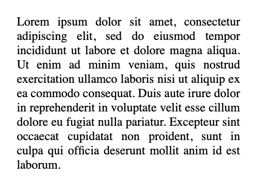

## Overview
Here's what you're going to learn this lesson:
- text-transform
- font-size
- text-align
- letter-spacing
- word-spacing
- text-decoration

---

## Lots Of Properties
You're going to learn a lot of properties in this and the next lesson.
Don't worry if you can't remember them all.
The goal here is so you become familiar with the properties.
When you need to use a certain property, you can always use Google
or come back to this lesson.

## text-transform
#### What is it?
Use this to make text uppercase or lowercase.

#### Setup
Create an HTML file (or use CodePen). Use this HTML:

```html
<p>My name is John</p>
```

#### Challenge: Try Them Out!
`none | capitalize | uppercase | lowercase`

- try out these values on your own!
- in your own words, describe what each value does
- when you're done, read the descriptions below

```css
/* Example */
p {
  text-transform: uppercase; /* or none. Or uppercase. Or lowercase */
}
```

#### Values
- **none**: `My name is John`
  - no effect applied.
  - this is the default value
    - by "default", I mean it's added automatically. You don't have to write any code
- **capitalize**: `My Name Is John`
  - capitalize the first letter of each word
  - don't confuse this with "uppercase", which makes EVERY LETTER capitalized
- **uppercase**: `MY NAME IS JOHN`
  - capitalize EVERY LETTER
  - don't confuse this with "capitalize"
- **lowercase**: `my name is john`
  - make everything lowercase
  - notice: `My` becomes `my`, `John` becomes `john`

#### Usage
Okay, so why would you use `text-transform`? Stop and think of one or more reasons.


Use `text-transform` to easily change the capitalization of text.

For example, let's say you want to make your text uppercase.
"It's not that hard to change it in HTML", you might say.
In this case, sure. It's easy.

```html
<p>My name is John.</p>
<p>MY NAME IS JOHN.</p>
```

But what about in this case? Would you rather waste 10-20 minutes making each letter uppercase,
or just use 1 line of CSS?

```html
<p>
  Lorem ipsum dolor sit amet, consectetur adipiscing elit. Nam elementum lectus
  ut odio auctor, sit amet vehicula mauris suscipit. Sed sed erat in lorem
  viverra malesuada. Aliquam at sem elementum, condimentum ipsum at, tincidunt
  odio. Suspendisse mollis lectus sem, eget porta tortor faucibus at. Sed
  egestas scelerisque velit at rutrum. Donec nunc libero, tempor et dapibus
  quis, mollis vitae orci. Aenean sit amet elit sem. Nulla facilisi. Duis erat
  urna, laoreet eu turpis vitae, fermentum viverra risus. Nam sodales at mi a
  dictum. Duis arcu lacus, volutpat a fringilla et, aliquet vel ligula. In quis
  efficitur magna. Fusce ut magna metus. Nullam ultrices imperdiet est lacinia
  auctor. Suspendisse sed augue ex. Duis vehicula velit dui, ac cursus massa
  ullamcorper non. Nam libero metus, cursus ut scelerisque pretium, gravida sed
  leo. Aliquam lacus ligula, vestibulum ut pretium ac, cursus eget mi. Nulla
  facilisis quis risus vel porta. In porta leo sed magna tempor, sed vulputate
  neque feugiat. Curabitur ut elit ligula. Aenean sit amet nunc eu orci aliquet
  vestibulum. Nunc viverra id nisl at dignissim. Fusce nisl justo, vestibulum
  sed enim et, malesuada tempor nisl. Etiam sit amet tortor neque. Mauris eu
  orci ornare, ultrices justo quis, fringilla dolor. Maecenas tempus dui in ex
  porta interdum. Nulla dapibus erat eget ante lacinia molestie. Nam ut lorem ac
  purus dapibus posuere. Pellentesque congue sem elit, at elementum neque
  condimentum at. Phasellus tempor enim enim, non aliquam orci euismod eget.
  Praesent feugiat sapien sed quam ultrices blandit. Morbi malesuada, purus eu
  rutrum ultrices, tortor metus aliquam ex, sed vulputate mauris mauris eu nisi.
  Nullam lacinia, neque vel cursus ornare, erat odio fermentum nunc, viverra
  rhoncus lacus turpis vel nunc. Praesent vel viverra nisi. Sed egestas ex eget
  urna lobortis mattis. Donec ac scelerisque neque, nec blandit mauris. Nam et
  velit tempor, iaculis dui sed, consequat nulla. Integer dolor lectus, eleifend
  eu justo vitae, condimentum semper risus. Fusce sodales eget lorem vitae
  vehicula. Pellentesque quis nibh hendrerit, consequat velit sed, cursus ante.
  Pellentesque mattis sem et est elementum pretium. Aliquam non dignissim lacus.
  Curabitur sagittis commodo massa vel mollis. Pellentesque a odio eros. Nam
  semper quam leo, lobortis faucibus mauris pulvinar vel. Pellentesque finibus
  varius orci id pulvinar. Vestibulum aliquam elementum erat. Morbi tempor eu
  ante vel pharetra. In blandit rutrum lobortis. Interdum et malesuada fames ac
  ante ipsum primis in faucibus.
</p>
```



## font-size
#### What is it?
Use this to control the size of your text.
But before you can use it, you need to learn what a pixel is.

#### What is a pixel?
You can think of a pixel as a "unit of measurement" like centimeters or inches.
It gets a bit complicated, but for now, think of a pixel as a little "dot" on your computer/device screen.
This will make a lot more sense once you start using the pixels.

#### Setup
Use this HTML

```html
<p>My name is John</p>
```

#### Challenge: Try It Out!
- change the `font-size`. Try different pixel sizes and see what happens (e.g. 0px, 1px, 100px, 500px)

```css
p {
  font-size: 12px; /* 1px, 100px, 500px, etc */
}
```


## text-align
#### What is it?
Use this to control the horizontal placement of your text.
For example, you can push your text to the left side, right side, or center it.

#### Setup
Use this HTML

```html
<h1>Hello, text-align</h1>
<p>
Lorem ipsum dolor sit amet, consectetur adipiscing elit, sed do eiusmod tempor incididunt ut labore et dolore magna aliqua. Ut enim ad minim veniam, quis nostrud exercitation ullamco laboris nisi ut aliquip ex ea commodo consequat. Duis aute irure dolor in reprehenderit in voluptate velit esse cillum dolore eu fugiat nulla pariatur. Excepteur sint occaecat cupidatat non proident, sunt in culpa qui officia deserunt mollit anim id est laborum.
</p>
```

#### Challenge: Try It Out!
`left | center | right | justify`

- try out these values on your own!
  + try out each value for the `<h1>` and the `<p>`
- in your own words, describe what each value does
- when you're done, read the descriptions below

#### Values
- **left**: align text to the left side
- **right**: align text to the right side
- **center**: center the text

#### text-align: justify;


The `justify` value makes each line of text the same width
- notice how it's like a square box (except the last line)
- notice how big the gaps/spaces are between words. 
`justify` will make the spaces between words bigger/smaller to make sure each line is the same size.

(Fun fact: those spaces between words are called "rivers").


## letter-spacing
#### What is it?
Use this to control the space between letters.

#### Setup
Use this HTML

```html
<p>My name is John</p>
```

#### Challenge: Try It Out!
- change the `letter-spacing`. Try different pixel sizes and see what happens (e.g. 0px, 1px, 5px...)
- try negative pixel values (e.g. -1px, -10px...)
- try `letter-spacing: normal`. See what happens.

```css
p {
  letter-spacing: 2px;
}
```


- positive value: more space between letters (stretches out)
- negative value: less space between letters (squish in)
- normal: the default value



## line-height
#### What is it?
`line-height` controls the height of a line of text. Another way to think of it: the vertical distance / space between lines of text.

#### Setup
Use this HTML

```html
<p>Lorem ipsum dolor sit amet, consectetur adipiscing elit. Nam elementum lectus
  ut odio auctor, sit amet vehicula mauris suscipit. Sed sed erat in lorem
  viverra malesuada. Aliquam at sem elementum, condimentum ipsum at, tincidunt
  odio. Suspendisse mollis lectus sem, eget porta tortor faucibus at. Sed
  egestas scelerisque velit at rutrum. Donec nunc libero, tempor et dapibus
  quis, mollis vitae orci. Aenean sit amet elit sem. Nulla facilisi. Duis erat
  urna, laoreet eu turpis vitae, fermentum viverra risus. Nam sodales at mi a
  dictum. Duis arcu lacus, volutpat a fringilla et, aliquet vel ligula. In quis
  efficitur magna. Fusce ut magna metus. Nullam ultrices imperdiet est lacinia
  auctor. Suspendisse sed augue ex. Duis vehicula velit dui, ac cursus massa
  ullamcorper non. Nam libero metus, cursus ut scelerisque pretium, gravida sed
  leo.
</p>
```

#### Challenge: Try It Out!
- change the `line-height`. Try different pixel sizes and see what happens (e.g. 0px, 5px, 10px...)
- try using numbers and see what happens (e.g. 0, 1, 1.5, 2, 3)
- try `line-height: normal`

```css
p {
  line-height: 2;
}
```

#### Values
- **pixel value**: increase/decrease the vertical distance between lines
- **number value**: "multiply" the line-height (e.g. `line-height: 2` is double the value of `line-height: 1`)
- **normal**: default value

#### Usage
You know when in highschool, you had to write an essay and make sure it was "double spaced"?
You can do that in CSS with `line-height: 2`!


## word-spacing
#### What is it?
Use this to control the space between words. Very similar to `letter-spacing`

#### Setup
Use this HTML

```html
<p>My name is John. I am learning to program.</p>
```

#### Challenge: Try It Out!
- change the `word-spacing`. Try different pixel sizes and see what happens (e.g. 0px, 1px, 5px...)
- try negative pixel values (e.g. -1px, -10px...)

```css
p {
  word-spacing: 2px;
}
```


- positive value: more space between words (stretches out)
- negative value: less space between words (squish in)
- normal: the default value



## text-decoration-line
#### What is it?
You can add lines above, below, or through text.

#### Setup
Use this HTML:

```html
<h1>Hello there</h1>
<p>My name is John</p>
```

#### Challenge: Try Them Out!
`underline | overline | line-through`

- try out these values on your own!
- in your own words, describe what each value does
- when you're done, read the descriptions below

```css
/* Example */
h1 {
  text-decoration-line: underline;
}
```

#### Values
- **underline**: line under text
- **overline**: line above text
- **line-through**: line through the text

#### Multiple Values
You can combine multiple values. For example, you can have an underline and an overline.

```css
h1 {
  text-decoration-line: underline overline;
}
```

### Question: Using All Three Lines
In CSS, how would you add an underline, overline, and line-through to an element?


```css
h1 {
  text-decoration-line: underline overline line-through;
}
```



## text-decoration-color
#### What is it?
Change the color of the `text-decoration-line`.

NOTE: you need to use `text-decoration-line` and `text-decoration-color` together. You can't color a line that doesn't exist!

#### Setup
Use this HTML:

```html
<h1>Hello there</h1>
<p>My name is John</p>
```

```css
/* Example */
h1 {
  text-decoration-line: underline;
  text-decoration-color: green;
}
```

#### Challenge: Try It Out!
1. Add an rgba `text-decoration-color` line to the `<h1>`
2. Add a hex `text-decoration-color` line to the `p`

Don't forget to add a `text-decoration-line` as well!


``` css
h1 {
  text-decoration-color: #2da9ce;
  text-decoration-line: overline line-through;
}
p {
  text-decoration-color: rgba(22, 100, 77, 1);
  text-decoration-line: underline;
}
```



## text-decoration-style
#### What is it?
Change the appearance/style of the line. Remember: you need to use `text-decoration-line` as well. You can't style the line if it doesn't exist.

#### Setup
Use this HTML:

```html
<h1>Hello there</h1>
<p>My name is John</p>
```

#### Challenge: Try Them Out!
`double | dotted | dashed | wavy | solid`

- try out these values on your own!
- in your own words, describe what each value does
- when you're done, read the descriptions below

```css
/* Example */
h1 {
  text-decoration-line: underline;
  text-decoration-style: solid;
}
```

#### Values
- **double**: 2 lines instead of 1
- **dotted**: dotted line
- **dashed**: dashed line
- **wavy**: wavy line
- **solid**: default value. Solid line


### Challenge: Use All 3 Properties
Alright, your challenge now: use all three properties on a single element.
- choose a line type (underline, overline, line-through)
- choose a color
- choose a style


```css
h1 {
  text-decoration-line: underline overline;
  text-decoration-color: #fjwj1d;
  text-decoration-style: wavy;
}
```



## text-decoration
#### What is it?
"Another one I have to remember?!"
No, this is actually a "shortcut". 
Instead of writing `text-decoration-line`, `text-decoration-color`, and `text-decoration-style`, you can just use `text-decoration`. 

#### How does it work?
```css
text-decoration: <lines> <color> <style>
```

Note that the color and style are optional.

#### How do I use it?
Like this:

```css
h1 {
  text-decoration: underline overline; /* <lines> */
}

h1 {
  text-decoration: underline overline green; /* <lines> <color> */
}

h1 {
  text-decoration: underline overline green dashed; /* <lines> <color> <style> */
}
```

As you can see, only `text-decoration-line` is necessary. The rest are optional.
Pretty nice, right? You just use 1 property (`text-decoration`) instead of 3!

#### Challenge: Line & Style
Add a line above the `<p>` and a style of your choice. Don't add a color.
```html
<p>Hello there</p>
```


```css
p {
  text-decoration: overline dotted;
}
```


#### Do I have to use `text-decoration`?
No, feel free to use the other 3 properties if you want. You're gonna be doing more typing though.


## A Closing Note
You went through a lot of properties this lesson. 
It can be overwhelming trying to memorize all of this stuff.

Here's the thing: don't worry about memorizing them. If you ever forget something, you can just Google it.
If you forget about `text-decoration`, Google "how to add line above text css". 
If you forget how `line-height` works, just Google "how to add space between lines css".

As long as you understood what each property does, you're good to go!

---
## Summary
Here's what we covered this lesson:<br>
- `font-size`
- `letter-spacing`: change space between letters
- `line-height`: change vertical/up-and-down space between lines of text
- `text-align`: move text to the right, left, center, or justify (spread out)
- `text-transform`: upper/lowercase
- `word-spacing`: change space between words
- `text-decoration`: add a line below, above, or through text
  + `text-decoration-line`: line type
  + `text-decoration-color`
  + `text-decoration-style`

#### Worksheet
None for this lesson. Check the next lesson for the worksheet.

#### Lastly...
If there was anything you didn't understand, need help with, or think I could explain better, please let me know!
I appreciate every response and will reply as soon as I can.

---
## Sources
- [MDN - Fundamental text and font styling](https://developer.mozilla.org/en-US/docs/Learn/CSS/Styling_text/Fundamentals)
- [MDN - CSS reference](https://developer.mozilla.org/en-US/docs/Web/CSS/Reference)
