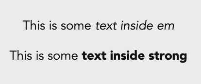
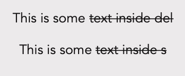

## Overview
Here's what you're going to learn this lesson:
- more text-related tags, including when/how to use them

---

## Challenge: \<em> & \<strong>
We'll start with these two tags.
1. Put the 2 tags (`<em>` and `<strong>`) in an HTML file. 
2. In your own words, explain what appears

You use the tags like this:

```html
<p>This is some <em>text inside em</em></p>
<p>This is some <strong>text inside strong</strong></p>
```


You should see something like this:<br>


Notice: the `<em>` text is in italics. The `<strong>` text is bolded.<br>


## \<em> To Emphasize
You use `<em>` to "em"phasize or stress certain words.<br>
By default, browsers will *italicize* `<em>` elements.<br>

#### What do you mean by emphasize/stress?
Consider the following sentence:

"My cat didn't eat my homework."

You might be thinking, "*Of course not. Since when do cats eat homework?*"

Well, what happens to the meaning if we stress a word?<br>

"My cat **_didn't_** eat my homework."

By stressing one word, we changed the meaning and feeling of the sentence:
- maybe something happened to your homework
- your cat did (or didn't?) do something

When you emphasize certain word(s), you can change the feeling/meaning of a sentence.

#### What words should I "em"phasize/stress?
That's for you to decide. However, here's something that might help you.

Imagine you're working on an essay for your programming class.<br>
What word(s) do you italicize, bold, or highlight?
Those are word(s) you might want to wrap with `<em>` tags.


## \<strong> To "Strongly" Emphasize
You use `<strong>` to "strongly" emphasize certain words.<br>
By default, browsers will make `<strong>` elements **bold**.

#### What do you mean by "strongly" emphasize?
Consider the following sentences:

"The plane is leaving in one minute. **Please board now.**"<br>
"**Danger: do not touch the poisonous flower. You will die.**"

The words inside `<strong>` are more important. They have the feeling of, "pay attention!"

#### Okay... then when do I use \<strong>?
Like `<em>`, there are no hard rules that I can give you.<br>
It's something you have to decide for your own content.
Use `<strong>` when you want to say, "these words are important! Pay attention to these words".

#### What's the difference between \<em> and \<strong>?
One way to think of it is like this: `<em>` means "*important*" and `<strong>` means "*very important*".


## \<del> and \<s> to Strikethrough
#### Challenge: Try Them Out!
You know the drill: try out these tags first and see what happens!
You use them like this:

```html
<p>This is some <del>text inside del</del></p>
<p>This is some <s>text inside s</s></p>
```


The text inside `<del>` and `<s>` have a line through them.<br>
By default, your browser adds this "strikethrough" effect.



#### When do I use \<s>? When do I use \<del>?
There's a great [Stack Overflow post](https://stackoverflow.com/a/39311143) that talks about the differences between these two tags.

To summarize the post...

#### Use \<s> for text that is not accurate anymore
For example, let's say you opened a restaurant and created a menu:

```html
<h1>Restaurant Menu</h1>
<p>Cookies</p>
<p>Cake</p> 
<p>Ice Cream</p>
```

However, the Cake Monster came in and ate all your cake!<br>
Now, you have no more cake and you need to update your menu.<br>
This is a good chance to use the `<s>`. "Cake" is not accurate anymore because you ran out!

```html
<h1>Restaurant Menu</h1>
<p>Cookies</p>
<p><s>Cake</s></p> 
<p>Ice Cream</p>
```

#### Use \<del> for text that has been edited or removed
Let's say you're tired of baking cakes and decide to leave the restaurant business to become a programmer.
You begin working on your goodbye letter.

```html
<p>
Sorry everyone, I am leaving the restaurant business. 
Goodbye forever.
</p>
```

However, your favourite customer, Cake Monster, begs you not to leave.
Who else will make delicious cakes for Cake Monster? You're the only one who can do it.<br>
After thinking long and hard, you decide to stay in the restaurant business. 
You need to fix your letter:
```html
<p>
  <del>Sorry everyone, I am leaving the restaurant business. Goodbye forever.</del>
  Actually, I am not leaving. Cake Monster needs me.
</p>
```

In this case, `<del>Sorry everyone, I am leaving the restaurant business. Goodbye forever.</del>` is the text you "deleted".

You can also use `<del>` for text edits. For example:

```html
<p>
  <del>I will be busy making cakes for Cake Monster</del>
  Actually, I was too busy watching Netflix...
</p>
```

#### Hold on, I'm still confused!
Yeah, it's pretty confusing! The differences between `<del>` and `<s>` are not super clear, so don't worry if you don't completely understand them right now.<br>
As you learn more HTML and build your own websites, things will make more and more sense.

To quickly summarize:
- use `<s>` when the text is not accurate/true anymore
- use `<del>` for text edits/deletes

#### What if I just want a strikethrough effect?
If your use case doesn't fit the two cases above (text not accurate, text edits/deletes), you can style your text using CSS.<br>

***

## Summary
Here's what we covered this lesson:<br>
- use `<em>` to stress/emphasize certain words
  + *italicized* by browsers
- use `<em>` for text that is more important
  + has a stronger meaning than `<em>` (e.g. important VS very important)
  + **bolded** by browsers
- use `<s>` for text that is no longer accurate
  + <del>strikethrough'd</del> by browsers
- use `<del>` for text edits or deleted text
  + <del>strikethrough'd</del> by browsers

#### Worksheet
This worksheet covers this lesson and the previous lesson: [click here!](worksheet)

#### Lastly...
If there was anything you didn't understand, need help with, or think I could explain better, please let me know!
I appreciate every response and will reply as soon as I can.

***

## Sources
- [MDN - Text Fundamentals](https://developer.mozilla.org/en-US/docs/Learn/HTML/Introduction_to_HTML/HTML_text_fundamentals)
- [Difference Between s and del](https://stackoverflow.com/questions/16743581/what-is-the-difference-between-s-and-del-in-html-and-do-they-affect-website)