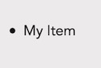
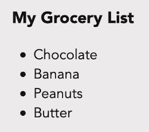
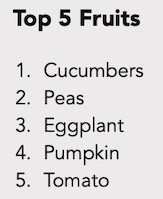
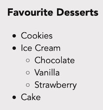

## Overview
Here's what you're going to learn this lesson:
- lists

---

## Challenge: Make a List
Here's the situation: someone broke into your house last night and stole all of your food!<br>
You haven't eaten since 9PM yesterday evening and you're starving now.<br>
Thankfully, the thief didn't take your wallet. It's time to head to the store!

But before you can embark, you need to know what items you're going to buy.<br>
Here's your challenge: make a shopping list of 5 items or so.


You done? Okay, let's get going.


## Unordered Lists
Unordered lists are... wait for it... lists that aren't ordered.<br>
They are lists where the order doesn't matter. 

For example, that random shopping list you created. 
Does it *really* matter if you buy apples first, then pears? Or pears then apples? In most cases... probably not.
The list is unordered because the order doesn't matter.

#### Create Unordered List: \<ul>
You create unordered lists with the `<ul>` tag. "u" stands for "unordered" and "l" stands for "list".<br>
Create a new HTML file and put this in the body.
```html
<ul>
</ul>
```

What happened? What do you see?

If you typed it right, you should see... nothing. That's because, right now, the list is empty.
To add a list item, you put `<li>` tags inside of `<ul>`.

```html
<ul>
  <li>My Item</li>
</ul>
```

You should see something like this:<br>


#### Multiple List Items
Adding multiple list items is easy. Just add more `<li>` elements.

```html
<ul>
  <li>Wow</li>
  <li>So Item</li>
  <li>Much List</li>
</ul>
```

#### Challenge: Grocery List
1. Create a list of grocery items.
2. Add a heading tag with the text "My Grocery List". Put it above and **outside** of the `<ul>`

You should end up with something like this (but with your own items):<br>



Here's what my HTML looks like:
```html
<h3>My Grocery List</h3>
<ul>
  <li>Chocolate</li>
  <li>Banana</li>
  <li>Peanuts</li>
  <li>Butter</li>
</ul>
```



## Ordered Lists
Unordered lists are great and all... but what if you want your items to be ordered?<br>
For example, a list of the top 5 greatest movies of all time.
Or a list of top 10 most delicious cakes. Or top 100 songs by \<insert your favourite artist here>.
When the order matters, use `<ol>` ("o" stands for "ordered").

```html
<h3>Top 5 Fruits</h3>
<ol>
  <li>Cucumbers</li>
  <li>Peas</li>
  <li>Eggplant</li>
  <li>Pumpkin</li>
  <li>Tomato</li>
</ol>
```

And the list looks like this:<br>


Notice how, with ordered lists, the list items are numbered automatically.

## Nested Lists
The last thing we're going to talk about is "nesting" lists. "Nesting" just means putting lists inside of lists.
For example, you can do this:



And the code looks like this:
```html
<h3>Favourite Desserts</h3>
<ul>
  <li>Cookies</li>
  <li>Ice Cream
    <ul>
      <li>Chocolate</li>
      <li>Vanilla</li>
      <li>Strawberry</li>
    </ul>
  </li>
  <li>Cake</li>
</ul>
```

#### That's kind of confusing...
It's actually not too bad if you break it down.
We have two lists, the "container" / outer list, and the nested / inner list.

```html
<!-- Outer List -->
<h3>Favourite Desserts</h3>
<ul>
  <li>Cookies</li>
  <li>Ice Cream</li>
  <li>Cake</li>
</ul>

<!-- List to put inside -->
<ul>
  <li>Chocolate</li>
  <li>Vanilla</li>
  <li>Strawberry</li>
</ul>
```

Now, figure out which `<li>` / list item you want to nest it under. Cookies? Ice Cream? Cake?
If you want to put it under Cake, then:

1. Move the `</li>` to the next line

```html
<ul>
  ...
  <!-- Move the </li> onto the next line -->
  <!-- Notice: <li>Text -->
  <li>Cake
  </li>
</ul>
```

2. Paste the list below the `<li>Text` and above the closing `</li>` tag.

```html
<ul>
  ...
  <li>Cake <!-- Paste the nested list below -->
    <ul>
      <li>Chocolate</li>
      <li>Vanilla</li>
      <li>Strawberry</li>
    </ul>
  </li>
</ul>
```

Notice the order: `<li> -> <ul> -> <li>`.<br>
As with anything... practice makes better!

## A Brief Summary
So far, we've just scratched the surface of HTML.
There's still a lot more ground to cover, but you've actually learned a lot over the last several lessons:
- HTML tags and attributes
- comments
- the `<head>` tag
- creating and opening HTML files
- text-related tags
- lists

In the next section, you're going to learn about the next fundamental building block of web development: CSS!

***

## Summary
Here's what we covered this lesson:<br>
- unordered lists: `<ul>`
- ordered lists: `<ol>`
- list item: `<li>`. Goes inside of `<ul>` or `<ol>`
- you can nest/put lists inside of each other

#### Worksheet
Here's the worksheet for this lesson: [click here!](worksheet)

#### Lastly...
If there was anything you didn't understand, need help with, or think I could explain better, please let me know!
I appreciate every response and will reply as soon as I can.

***

## Sources
- [MDN - Text Fundamentals](https://developer.mozilla.org/en-US/docs/Learn/HTML/Introduction_to_HTML/HTML_text_fundamentals)