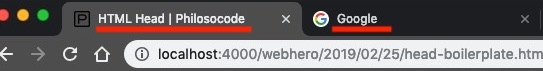
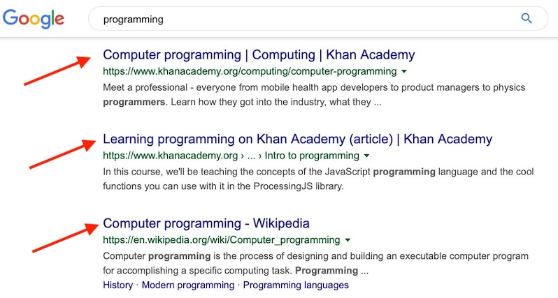

## Questions
The head contains...

Information about the page:
- title
- author
- description
- icon
etc...


What are 2 things you use `<link>` for?

1. Link to icons
2. Link to CSS files


Where are 2 places you can find the `<title></title>`?

1. Browser tabs  


2. Search results  



What do you use `<script></script>` for?

Link to JavaScript files


`<!DOCTYPE html>` just means, "[...]"

"This document contains HTML"


`<meta>`: what are the `name=` and `content=` attributes used for?

`name=` is the category you are describing. e.g. `<meta name="author">`
`content=` is the content or value for the category. e.g. `<meta name="author" content="Tam Le">`


What is the "root element" and what does it do?

`<html></html>`  
It wraps around all the other tags (except `<!DOCTYPE html>`)



## Challenges
#### Explain The Boilerplate
You've made it this far and now have all the knowledge needed to understand the "HTML Boilerplate".  
Here's your challenge: add comments above each line of code, explaining what it does.

```html
<!DOCTYPE html>
<html>
  <head>
    <meta charset="UTF-8">
    <meta name="viewport" content="width=device-width,initial-scale=1">
    <title>Title</title>
    <meta name="author" content="name">
    <meta name="description" content="description here">
    <meta name="keywords" content="keywords,here">
    <link rel="shortcut icon" href="favicon.ico" type="image/vnd.microsoft.icon">
    <link rel="stylesheet" href="//fonts.googleapis.com/css?family=font1|font2|etc" type="text/css">
    <link rel="stylesheet" href="stylesheet.css" type="text/css">
  </head>
  <body>
  </body>
</html>
```

#### Investigate the Title
1. Go to Google and do a search about anything you want
2. At the search results page, find a site that you like
3. Write down the site's title
4. Go to the site
5. Right click -> "Show Page Source"
6. Find the `<title></title>` tags. To make it easier, you can use Ctrl+F or Cmd+F to search for it

Did the search result title match the `<title></title>`?