## It's Time
So far, you've used CodePen to create and run your HTML code.
CodePen is a great tool that makes it easy to start coding. If you want, you can continue using it throughout these tutorials.  
However, knowing how to setup a project on your computer is important. And when you start working on more serious projects, this is
usually how you'll be working.

## Overview
Here's what you're going to learn this lesson:
- how to create and open HTML files

---
## Creating HTML Files
#### Text Editor
It's finally time to use the text editor you downloaded in [Getting Started](). 
I'll assume you're using VS Code. If you're using a different text editor, the instructions may be a little different. 
If you're ever stuck, just Google it or post a comment here.

#### Step 1. Create A Folder
Create a new folder somewhere (e.g. your Desktop) to store the files.  
It doesn't matter where you put it. Just remember where it is!  
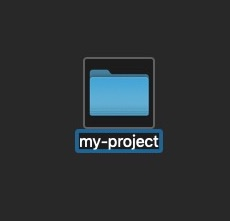

#### Step 2. Open Your Text Editor
If you're using VS Code, you should see something like this: 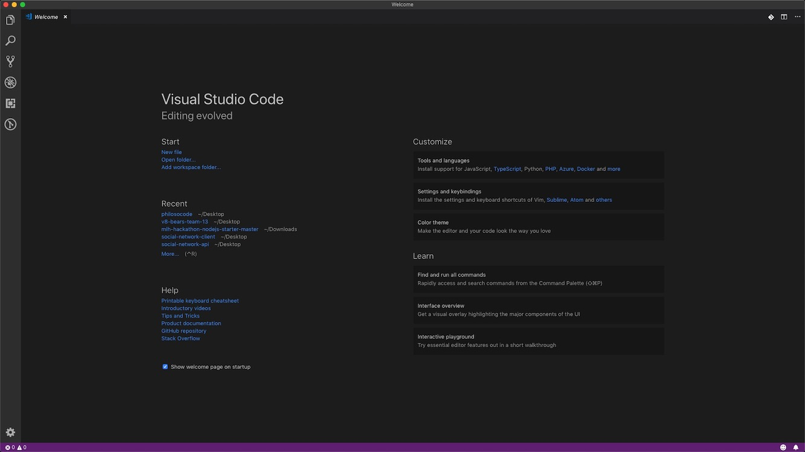

#### Step 3. Create A New File
There are a couple ways you can do this:
- press Ctrl + N on Windows/Linux, Command (⌘) + N on Mac
- or, go to File > New File  
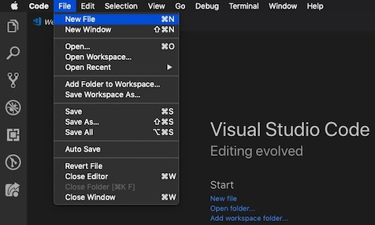

A new window with an empty file should open.
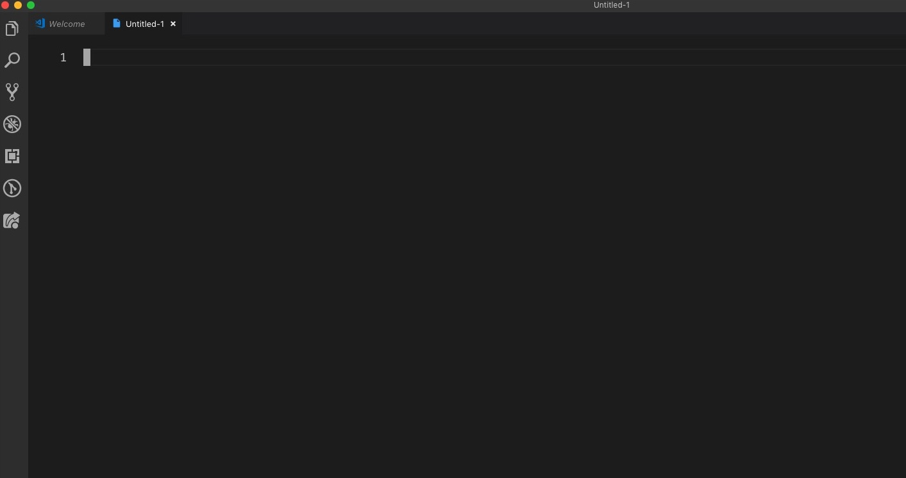

#### Step 4. Save The File
There are a couple ways you can do this:
- press Ctrl + S on Windows/Linux, Command (⌘) + S on Mac
- or, go to File > Save  
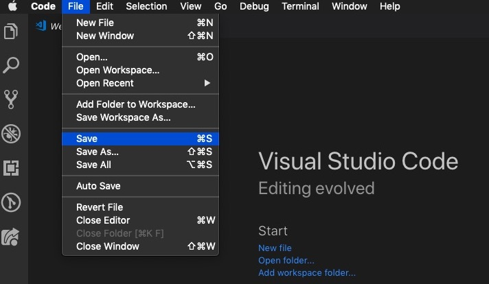

A window should appear with a box for the filename and location. 

On Mac, the box looks like this:  
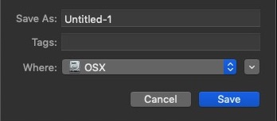

On Windows, the box looks like this:
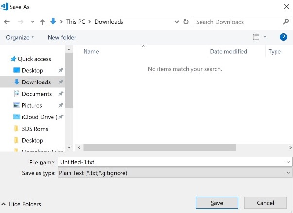

#### Step 5. Name The File
**Mac**  
Change the name of the file from "Untitled-1" to "myfile.html".  
**It is very important that the file ends in .html.**

**Windows**  
Same as above. However, you also need to change the "Save as type" to "HTML"
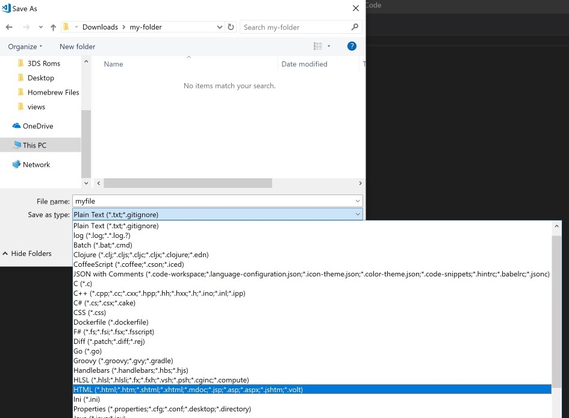

#### Step 6. Find The Folder You Created And Save The File
**Mac** 
On Mac, you may have to click on the little arrow first.  
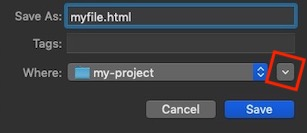

Once you click on the arrow, it should expand into a bigger window. 
Find the folder you created. 
Click on it. Then hit the "Save" button.
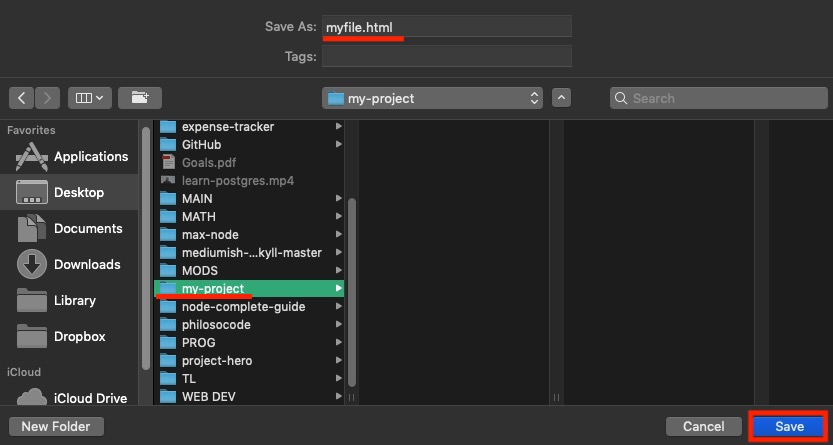

**Windows** 
On Windows, you need to find the folder, "Open" the folder, and then "Save" the file.

#### Step 7. Confirm The File Was Saved
Close your text editor.  
Now, go to the folder you created. You should see the file you saved.
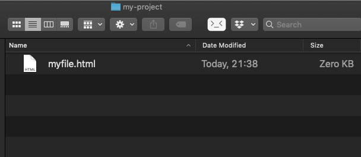

## Opening HTML Files
Now that you've created an HTML file, it's time to open it.

#### Step 1. Open
Press Ctrl + O (oh) on Windows/Linux, Command (⌘) + O (oh) on Mac. A window should open.

#### Step 2. Find Your File
All you have to do now is find your file, select it, and click "Open".

## HTML Boilerplate
Remember the HTML boilerplate introduced in [lesson #1]()? We're going to add it to the HTML file you created. 
If you're using VS Code or Sublime Text, there's a cool shortcut that will save you a lot of time. 
Note that this only works if you're in an HTML file (file that ends with `.html`).

Type "html:5" **without the quotation ("") marks** 
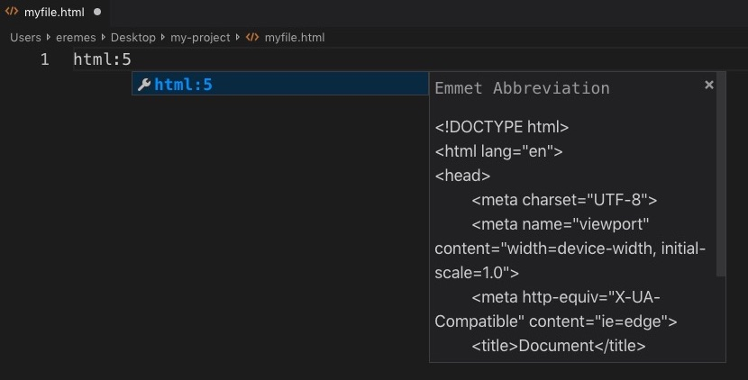

Then, hit "Tab" on your keyboard. The boilerplate should appear!
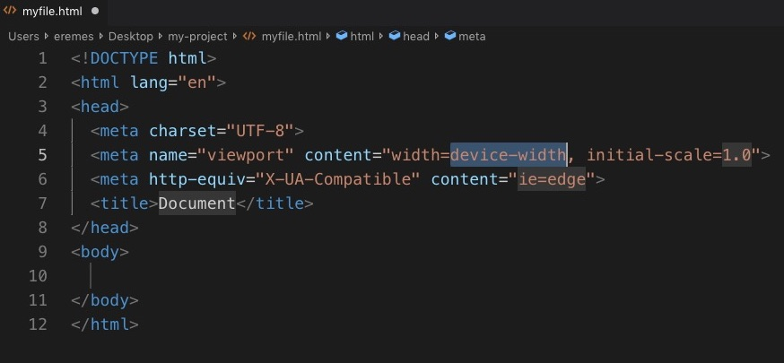

Pretty cool, huh?

By default, the content of the `<title>` element should say "Document". Change it to whatever you want.
In between the `<body>` tags, write some HTML. Use what you've learned in the previous lessons.

When you're done, save the file with Ctrl + S (Windows/Linux) or Command (⌘) + S (Mac).

## Opening HTML Files In Your Browser
At this point, you should've created an HTML file and added some code to it. Now, it's time to see the results of your hard work!  

Go to the folder where you saved the HTML file. If you double-click on it, it should open in your web browser.
On Windows, you may have to choose which program you want to use to open the file. If so, just pick your web browser.

Keep in mind: whenever you change the HTML file (add/delete code), you need to refresh the page before you see the changes 
(Ctrl + R on Windows/Linux, Command (⌘) + R on Mac).

## OPTIONAL: Using The "Live Server" Extension
NOTE: this is **completely optional!** 
Feel free to skip to the next lesson.

The knowledge that you gained in this lesson is more than enough for you at this point in time.  
However, there are some annoying things you have to deal with...
1. You have to manually find the HTML file and open it in your browser
2. You have to manually refresh the page to see changes

There's a great extension for VS Code called "Live Server". 
Live Server addresses the two pain points mentioned above.

1. All you have to do is open the folder containig your project and hit a button.
2. Changes appear automatically when you save your file. 

It's easy to setup, super convenient, and will make your (programming) life much easier!

If you're using a different text editor, you can Google "your-text-editor live server".  
However, for this guide, I'll assume you're using VS Code.

## Installing "Live Server"
#### Step 1. Install The Extension
Open VS Code and click on the icon for extensions. It kinda looks like a square inside of a square.
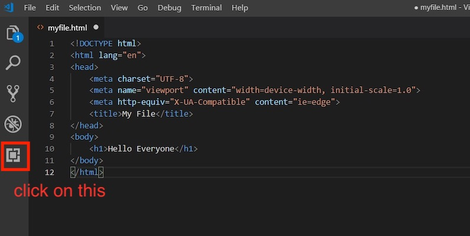

Next, in the "Search Extensions..." box, type "live server". Click on the little green "Install" button to install it.  
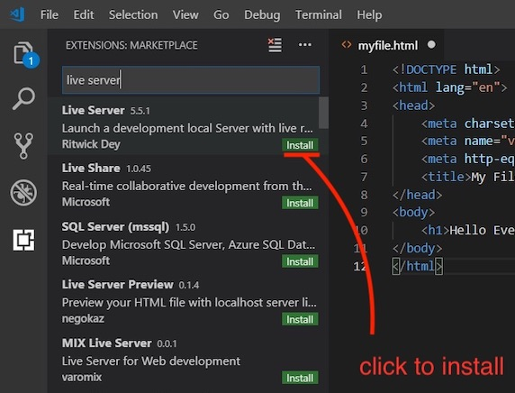

And that's it. Yep, it's that simple.

#### Step 2. Open The Folder
Before you can use Live Server, make sure you put your file(s) in a folder. 
In order to use Live Server, you must open the **folder** instead of the file.

**Mac**  
If you have VS Code in your dock, you can click and drag the folder onto the VS Code icon.  
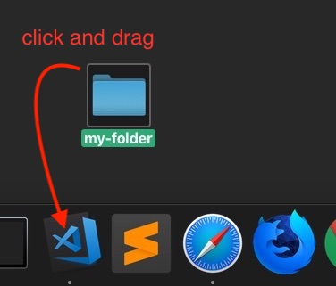

If you're on Mac and VS Code isn't in your dock, follow these steps:
1. Make sure VS Code is open. Press Cmd + O (oh) or File > Open
2. Click on the folder **one time** so it's highlighted. Don't go inside the folder (refer to the picture below)
3. Click "Open"
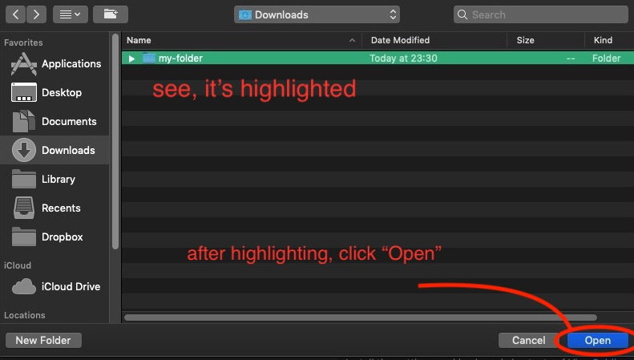

**Windows**
1. **Right click** on the folder
2. Choose "Open with Code"  
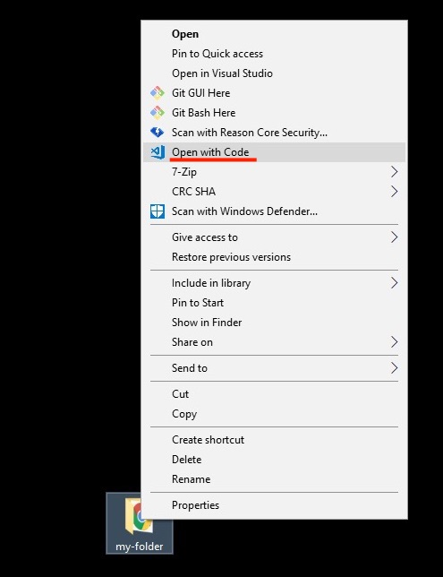

#### Step 3. Start Live Server
Back in VS Code, after you opened the **folder** (not the file), click on the file so you can see the HTML code.
In the bar at the bottom-right of VS Code, you should see a "Go Live" button.
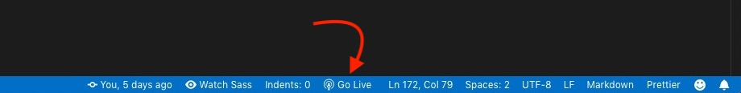

#### Step 4. Make Changes
After clicking on "Go Live", your web browser should open automatically and you should see your HTML page. 
To test that Live Server is running, make some changes to your HTML file and save it.
You should be able to see the new changes without having to refresh your browser!

#### Step 5. Close Live Server
When you're done, you can just close VS Code and the server will stop.  
Alternatively, you can close Live Server by clicking on "Port: 5500" in the bar on the bottom-right.
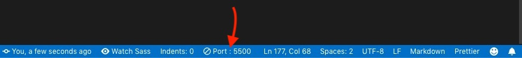

***

## Congratulations!
Now, you know how to create, edit, and open HTML files!  
Don't worry if it's still a little confusing. As you progress through this course, you'll make plenty of HTML, CSS, and JavaScript files.
Eventually, it will become second nature to you.

#### Challenge: Make Another File
Without looking at this lesson, try to create, edit, and open another HTML file.

#### Lastly...
If there was anything you didn't understand, need help with, or think I could explain better, please let me know!
I appreciate every response and will reply as soon as I can.