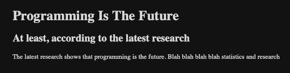
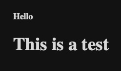
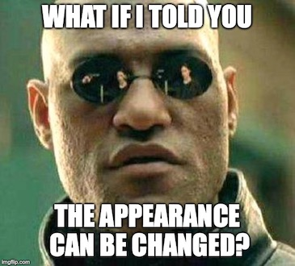

## Overview
Here's what you're going to learn this lesson:
- Heading tags
- Paragraph tags
- Line break & horizontal rule

---

## Challenge: Check Out All The Tags
Visit [this link](https://www.w3schools.com/tags/). There, you will see every HTML tag available to you.

Don't come back until you've memorized all of them!

#### Are you crazy? There are way too many tags!
Okay, I was just kidding. But it leads into the next point I want to make:

#### Focus On The Essential
I hope you don't feel too overwhelmed by the amount of tags you just saw.<br>
Of the ~90 tags listed on that site, **you'll only use 10-15 on a regular basis.**<br>
And for those 10-15 tags, you'll use them so much, remembering them won't be a problem.<br>
Remember: don't memorize what you can easily look up.


## \<hX> Heading Tags
You've already seen these tags before. They look like this:
``` html
<h1>Hello again!</h1>
<h3>I am a heading element</h3>
```

`<h1>` is the biggest and represents the main heading.  
You've probably already noticed, but as the number gets bigger, the size of the heading
decreases.

`<h2>` is a bit smaller. It is a sub-heading.  

#### Question: How many numbers are there?
We've seen `<h1>` and `<h2>`. 
How many more heading tags are there? 
(HINT: now is a good time to exercise your search engine skills)


Visit this link to find out http://bfy.tw/N1by


#### But what does it mean?
`<h1>` is the main, most important heading. There should only be one per page.<br>
`<h2>` is a subheading.
`<h3>` to `<h6>` are sub-subheadings.

MDN (listed in the Lesson Sources) has a great analogy.
You can think of `<h1>` as the title of the book. Usually, your book has only 1 title.
`<h2>` is like a chapter in the book; you can have many chapters.
`<h3>` to `<h6>` are like sections in each chapter.

#### How do I use the heading tags?
This is up to you to decide.<br>
If you were trying to represent a news article using HTML, you could do something like this:

```html
<!-- Main Heading -->
<h1>Programming Is The Future</h1>
<!-- Sub Heading -->
<h2>At least, according to the latest research</h2>
<!-- Content -->
<p>The latest research shows that programming is the future. 
Blah blah blah blah statistics and research</p>
```

And the HTML output looks like this:


Think about what makes sense for your content and keep in mind that:
- `<h1>` is the most important heading and should only be use once per page.
- the importance of the heading decreases as you move from `<h1>` to `<h6>`.

#### Can I use multiple \<h1>s?
Earlier, I said that there should only be one `<h1>` per page.<br>
But is it possible to use more than one?<br>
Actually, why don't you go ahead and try it? 

#### Challenge: Use Many \<h1> Tags
1. Create an HTML file like you did in the [previous lesson]().
2. Put a bunch of `<h1>` elements in your HTML file.
3. See what shows up


All the `<h1>` elements should show up properly.<br>
There's nothing stopping you from using `<h1>` everywhere.<br>
Why only 1 then?<br>
You'll find out in a few lessons when we cover "semantic" HTML!



## \<p> Paragraph Tag
`<p>` represents a paragraph. This is where you put your regular, non-heading text. 
What do I mean by "regular" text? A good example are the words in this sentence.
They're just normal words, like the hundreds to thousands of words that make up the chapter of a book.

#### Block-Level
`<p>` is a "block level" element, meaning each `<p>` element is put on a new line. 
You're probably thinking, "what does that mean?"

Let's look at an example.

#### Challenge: \<p> Tags VS Tags
Is there a difference between these 2 snippets of code?
```html
<p>
This is some text.
This is some more text.
And some more text!
</p>
```

```html
<p>This is some text.</p>
<p>This is some more text.</p>
<p>And some more text!</p>
```


In the first snippet, all the text is on 1 line.  
`This is some text. This is some more text. And some more text!`

In the second snippet, there are 3 lines in total. Each `<p>...</p>` element is put on a new line. 
`This is some text.`  
`This is some more text.`  
`And some more text!`


We'll cover block-level elements later in more detail, so consider this a sneak peek!

## \<br> and \<hr>
#### Challenge: Try The Tags
Question: What's the best way to see what a tag does?<br>
Answer: Use it!

Add `<br>` and `<hr>` to your HTML file and see what happens.


`<br>` adds a line break  
`<hr>` adds a horizontal line. It stands for "horizontal rule"


You can add multiple `<br>` to create multiple line breaks.  
For example, add this to your HTML file and see what happens:
```html
<h1>TITLE</h1>
<br>
<br>
<br>
<br>
<br>
<br>
<h2>Lots of space...</h2>
```

#### Challenge: Is There A Difference?
Here's a little review from lesson 1. Is there a difference between these 2 examples?
```html
<!-- <br> on new line -->
<h1>TITLE</h1>
<br>
<br>
<br>
<br>
<br>
<h2>Lots of space...</h2>
```

```html
<!-- All <br> on the same line -->
<h1>TITLE</h1>
<br><br><br><br><br>
<h2>Lots of space...</h2>
```


They both produce the same result.
In general, white space is ignored in HTML (there are some exceptions).



## Finishing Off
#### Challenge: Which is which?
In the image below, there is an `<h1>` tag and an `<h6>` tag. Which one is which?
  


The first line is an `<h1>`.
The second line is an `<h6>`.


#### Wait... what?
Yes, you read that right.  
The first line (the smaller one) is an `<h1>` and the second line, `<h6>`.  
You might be pretty confused right now. 
Actually, there's something I haven't told you yet...



By default, web browsers will do 2 things:
  - make the heading elements bold
  - make `<h1>` the biggest, `<h2>` smaller than `<h1>`, `<h3>` smaller than `<h2>`, and so on

However, you can use CSS to change the appearance of the headings.
With CSS, you can change the colour, size, and weight (normal, italics, bold) of a text tag.
This includes heading tags.

Basically, using CSS, you can make an `<h1>` look like an `<h6>`.

#### I'm still confused...
When you start learning CSS (in a few more lessons), this will make sense.<br>
The main takeaway is that that the appearance of tags can be changed using CSS.

***

## Summary
Here's what we covered this lesson:  
- heading tags: `<h1>` to `<h6>`
  + `<h1>` is the main, most important heading. There should only be one per page
  + importance decreases as you move from 1 to 6 (subheadings, sub-subheadings)
- paragraph tags: `<p>` 
  + represent normal text
  + block-level elements (each one is put on a new line)
- horizontal line/rule: `<hr>`
- line break: `<br>`

#### Worksheet
No worksheet for this lesson (will be included in the next lesson).


#### Lastly...
If there was anything you didn't understand, need help with, or think I could explain better, please let me know!
I appreciate every response and will reply as soon as I can.

***

## Sources
- [MDN - Text Fundamentals](https://developer.mozilla.org/en-US/docs/Learn/HTML/Introduction_to_HTML/HTML_text_fundamentals)